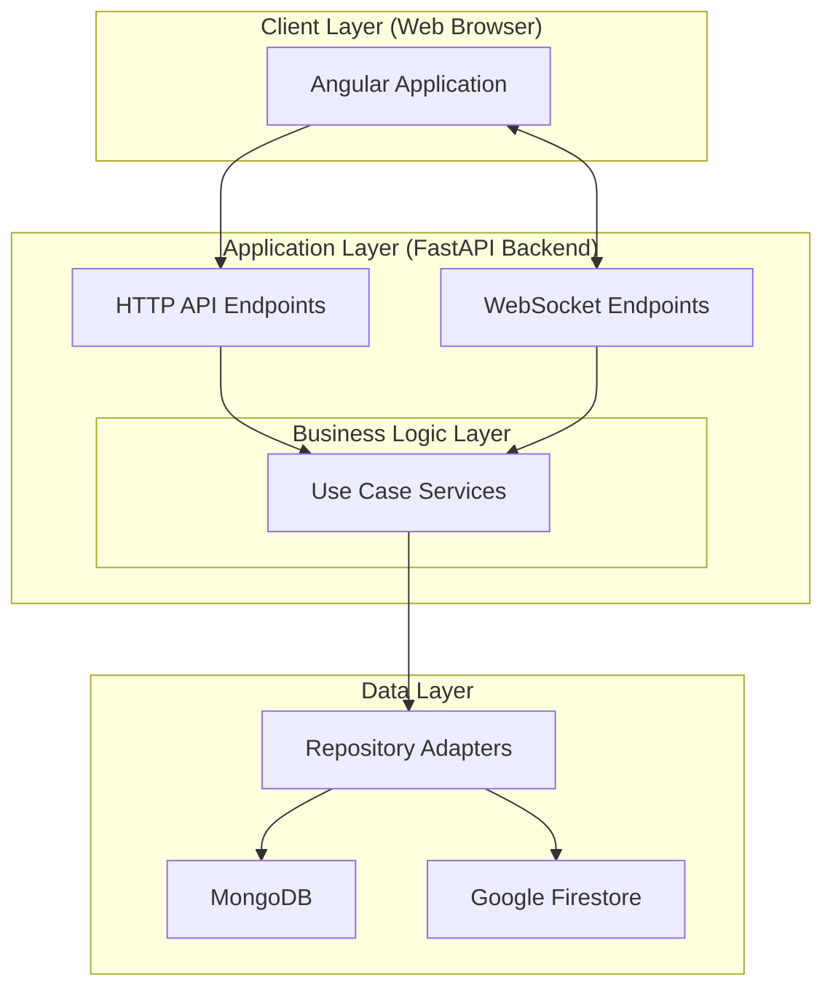

# Arquitetura do Sistema

O Agile Wheel implementa uma arquitetura moderna full-stack, com separação clara entre a apresentação no frontend, serviços de backend e camadas de persistência de dados.

Para obter informações técnicas mais aprofundadas sobre o funcionamento e a arquitetura do backend da aplicação, consulte a seção [**Backend**](../2-backend/README.md). Da mesma forma, para explorar os detalhes técnicos relacionados ao frontend, acesse a seção [**Frontend**](../3-frontend/README.md). Essas seções contêm explicações detalhadas sobre a implementação, principais componentes e fluxos de cada parte do sistema. 

# Visão Geral 

O Agile Wheel é uma aplicação web full-stack que implementa o Framework Agile Wheel, uma metodologia visual para medir maturidade ágil criada por Ana G. Soares. A aplicação permite que equipes avaliem colaborativamente suas práticas ágeis em quatro dimensões principais e visualizem os resultados por meio de gráficos de radar interativos.

## Propósito Principal

A aplicação serve como uma implementação digital do Framework Agile Wheel, oferecendo:

- **Sessões de Avaliação Colaborativa**: Vários membros da equipe podem participar de atividades de avaliação em tempo real.

- **Processo de Avaliação Estruturado**: Avaliação guiada através de 20 princípios ágeis organizados em 4 dimensões.

- **Resultados Visuais**: Visualização do perfil de maturidade ágil da equipe em gráficos de radar.

- **Gestão de Atividades**: Gerenciamento completo do ciclo de vida da atividade, desde a criação até a análise dos resultados.

## Principais Recursos

O sistema suporta os seguintes fluxos de trabalho principais:

| Capacidade                 | Descrição                                                          |
|----------------------------|--------------------------------------------------------------------|
| Criação de Atividade       | Inicializa novas sessões de avaliação com identificadores únicos   |
| Participação na Atividade  | Participa de atividades existentes utilizando códigos de atividade |
| Avaliação Colaborativa     | Submete avaliações individuais para cada princípio ágil            |
| Atualizações em Tempo Real | Sincronização ao vivo do status dos participantes e das submissões |
| Visualização de Resultados | Gera e exibe gráficos de radar com as avaliações agregadas         |
