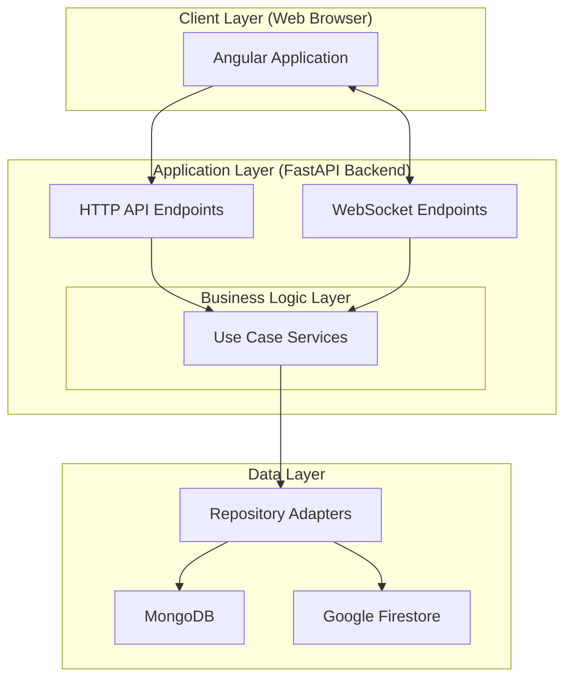

# Arquitetura do Sistema

O Agile Wheel implementa uma arquitetura moderna full-stack, com separação clara entre a apresentação no frontend, serviços de backend e camadas de persistência de dados.

Para obter informações técnicas mais aprofundadas sobre o funcionamento e a arquitetura do backend da aplicação, consulte a seção [**Backend**](../2-backend/README.md). Da mesma forma, para explorar os detalhes técnicos relacionados ao frontend, acesse a seção [**Frontend**](../3-frontend/README.md). Essas seções contêm explicações detalhadas sobre a implementação, principais componentes e fluxos de cada parte do sistema. 

