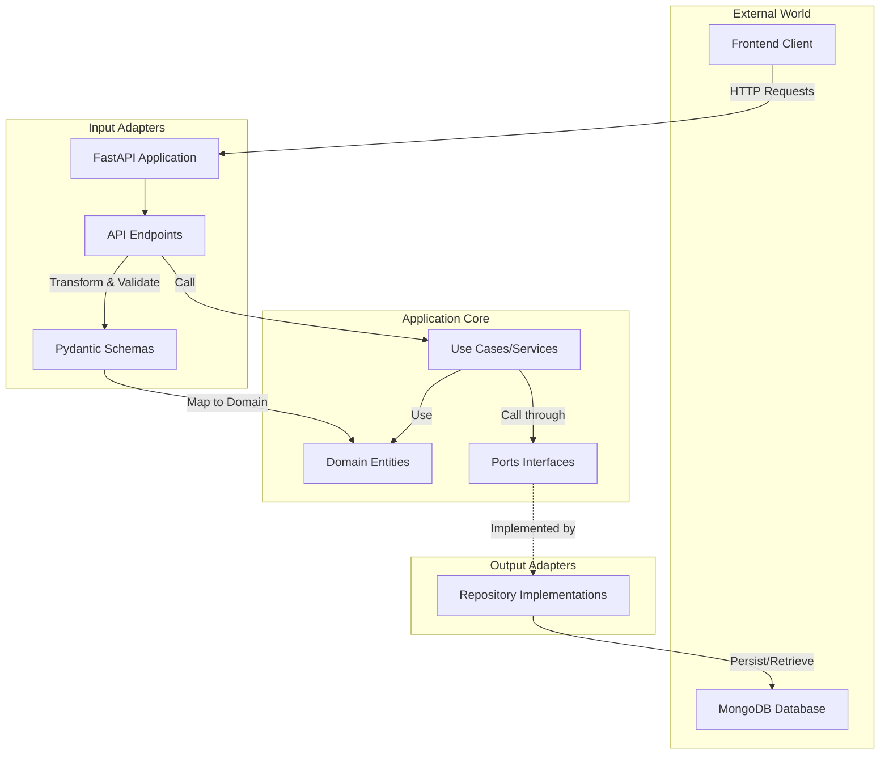
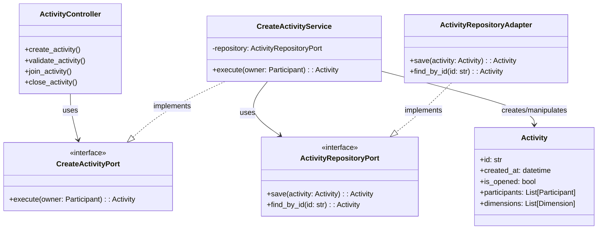
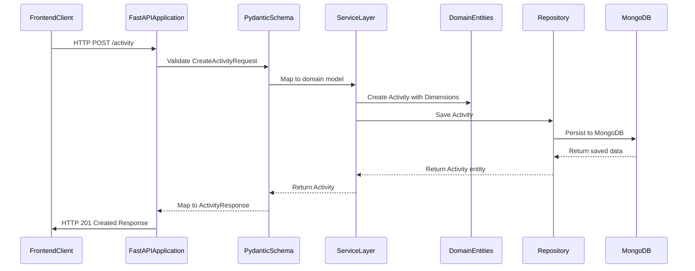
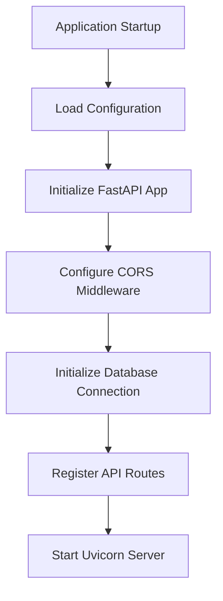
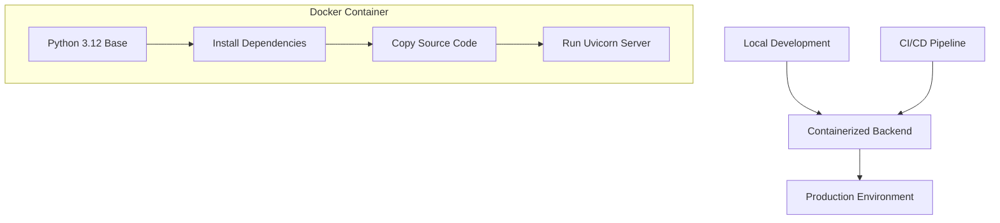

# Arquitetura de Backend

Esta seção descreve a arquitetura do aplicativo de backend Agile Wheel, desenvolvido com FastAPI e seguindo o padrão de arquitetura hexagonal (também conhecido como portas e adaptadores). Ele explica como o backend é estruturado, como as solicitações fluem pelo sistema e como o código é organizado para oferecer suporte à manutenibilidade e à testabilidade.

Para obter informações sobre o modelo de dados e as entidades usadas no sistema, consulte [Modelo de Dados](data-model.md).

## 1. Visão geral

O backend do Agile Wheel é desenvolvido usando FastAPI, um framework web Python moderno e de alto desempenho para a construção de APIs. A aplicação segue um padrão de arquitetura hexagonal para manter uma separação clara de interesses e garantir que a lógica do domínio permaneça isolada de dependências externas.



## 2. Implementação de Arquitetura Hexagonal

O backend segue o padrão de arquitetura hexagonal (Ports and Adapters), o que permite que a lógica de negócios principal permaneça isolada de questões externas, como frameworks de API e tecnologias de banco de dados. Essa arquitetura divide a aplicação em três camadas principais:

1. **Camada de Domínio**: Contém entidades de negócios e lógica
2. **Camada de aplicação**: contém casos de uso e interfaces de porta
3. **Camada de adaptadores**: contém adaptadores de entrada (controladores) e adaptadores de saída (repositórios)



### Camada de Domínio

A camada de domínio é o núcleo da aplicação, contendo as entidades de negócio e a lógica. Ela é completamente isolada de questões externas, como HTTP e bancos de dados.

As principais entidades na camada de domínio incluem:

- **`Activity`**: A principal entidade que representa uma atividade de avaliação ágil
- **`Participant`**: Representa usuários participando de uma atividade
- **`Dimension`**: Representa uma dimensão da agilidade que está sendo avaliada
- **`Principle`**: Representa princípios específicos dentro de uma dimensão que são classificados
- **`Evaluation`**: Representa as classificações dadas pelos participantes


### Camada de Aplicação (Casos de Uso)

A camada de aplicação contém casos de uso que orquestram as entidades de domínio para atender aos requisitos de negócios. Ela define interfaces de porta para entrada (orientadas por chamadas de API) e saída (orientando operações de persistência).

Os serviços nesta camada incluem:

- `CreateActivityService`: Cria uma nova atividade de avaliação
- Outros serviços para adesão, validação e encerramento de atividades

### Camada de Adaptadores

A camada de adaptadores conecta o aplicativo a sistemas externos, divididos em:

#### Adaptadores de entrada

Os adaptadores de entrada manipulam solicitações HTTP de entrada, validam dados de entrada e os convertem em objetos de domínio antes de passá-los para o caso de uso apropriado.

??? "backend/src/adapters/input/router.py"

    ```python title="backend/src/adapters/input/router.py"
    --8<-- "./backend/src/adapters/input/router.py"
    ```


#### Adaptadores de saída

Os adaptadores de saída implementam as interfaces de repositório definidas pela camada de aplicação, fornecendo implementações concretas para persistência de dados usando MongoDB por meio do Beanie/Motor.

## 3. Request Flow and Data Transformation

Vamos examinar como as solicitações fluem pelo sistema de backend:

### Request Flow Diagram



### Request Validation e Response Transformation

O backend utiliza modelos Pydantic para validação de solicitações e respostas. Os esquemas de solicitação definem a estrutura de entrada esperada e incluem regras de validação:

A API transforma entidades de domínio em DTOs de resposta usando métodos de mapeamento

??? "backend/src/adapters/input/schemas.py"

    ```python title="backend/src/adapters/input/schemas.py"
    --8<-- "./backend/src/adapters/input/schemas.py"
    ```

## 4. Application Configuration and Startup

O aplicativo de backend é configurado usando variáveis ​​de ambiente e inicia de forma estruturada:

### Application Startup Flow



### Configuration Management

O aplicativo usa o Pydantic `BaseSettings` para gerenciamento de configuração:

??? "backend/src/config/settings.py"

    ```python title="backend/src/config/settings.py"
    --8<-- "./backend/src/config/settings.py"
    ```

As configurações são carregadas de variáveis de ambiente ou do `.env` arquivo e armazenadas em cache para desempenho.


### Application Initialization

O aplicativo principal é criado e configurado no `main.py` arquivo:

??? "backend/src/main.py"

    ```python title="backend/src/main.py"
    --8<-- "./backend/src/main.py"
    ```

Esta configuração:

1. Cria um aplicativo FastAPI
2. Configura a vida útil do aplicativo para operações de inicialização/desligamento
3. Configura o middleware CORS
4. Registra rotas de API
5. Inicializa a conexão com o banco de dados

## 5. Containerization e Deployment

O backend é conteinerizado usando o Docker para implantação consistente em todos os ambientes:



### Configuração do Docker

O Dockerfile define como o backend é conteinerizado:

1. Usa Python 3.12.0 como imagem base
2. Configura o Poetry para gerenciamento de dependências
3. Copia e instala dependências
4. Copia o código fonte
5. Expõe a porta 8000
6. Executa o aplicativo FastAPI usando Uvicorn

## 6. API Endpoints

O backend expõe vários endpoints RESTful para criar e gerenciar atividades:

| Endpoint                           | Method | Description               | Request Schema          | Response Schema          |
|------------------------------------|--------|---------------------------|-------------------------|--------------------------|
| `/activity`                        | POST   | Create a new activity     | `CreateActivityRequest` | `CreateActivityResponse` |
| `/activity/{activity_id}`          | GET    | Get activity status       | -                       | `StatusResponse`         |
| `/activity/{activity_id}/join`     | POST   | Join an existing activity | `JoinRequest`           | `JoinResponse`           |
| `/activity/{activity_id}/close`    | POST   | Close an activity         | -                       | `CloseResponse`          |
| `/activity/{activity_id}/evaluate` | POST   | Submit evaluation         | `EvaluationRequest`     | `EvaluationResponse`     |

## 7. Resumo

A arquitetura de backend do Agile Wheel segue as melhores práticas modernas para desenvolvimento de API:

1. **Hexagonal Architecture**: Separação clara entre lógica de domínio, serviços de aplicação e interfaces externas

2. **FastAPI Framework**: desenvolvimento de API de alto desempenho e segurança de tipos com documentação automática

3. **Pydantic Validation**: tipagem e validação fortes para solicitações e respostas

4. **MongoDB Integration**: banco de dados não relacional para armazenamento flexível de dados

5. **Containerization**: implantação baseada em Docker para consistência em todos os ambientes

Essa arquitetura oferece vários benefícios:

- A lógica do domínio é isolada de preocupações externas
- Fácil de testar componentes de forma independente
- Flexível para adaptação às mudanças de requisitos
- Separação clara de responsabilidades

