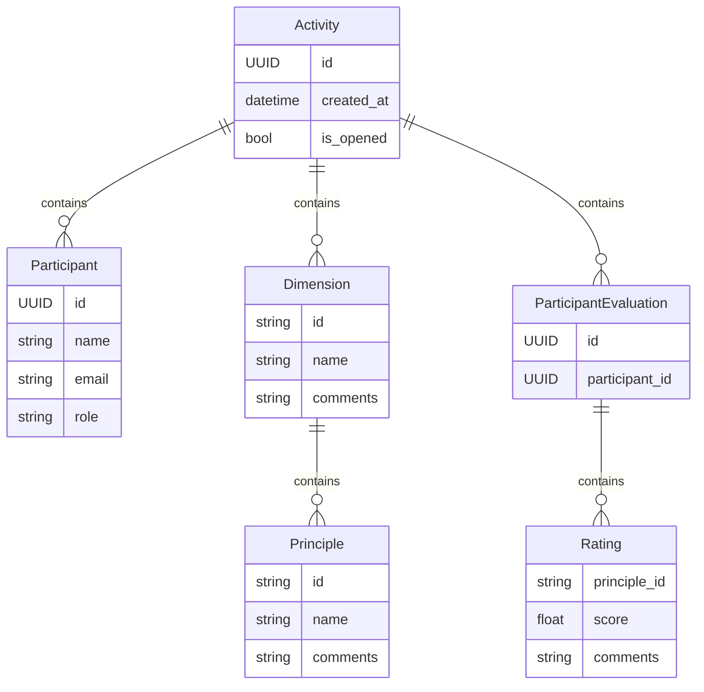

# Modelo de dados de alto nível

A aplicação Agile Wheel fundamenta-se em entidades de domínio que representam os principais conceitos do framework de avaliação ágil, incluindo as funcionalidades de avaliação colaborativa e atribuição de notas.

Neste documento, apresentamos as "entidades de domínio" do sistema Agile Wheel, seus relacionamentos e como esses elementos estruturam os dados da aplicação. Embora possam existir diferenças pontuais entre a implementação no backend e no frontend, o foco está em fornecer uma visão clara da estrutura de dados adotada pelo sistema em ambos os contextos.

O diagrama a seguir ilustra as principais entidades do domínio e seus relacionamentos, servindo como referência para a arquitetura da aplicação. **É importante destacar que este diagrama tem caráter exclusivamente ilustrativo: embora utilize a notação de um modelo entidade-relacionamento, o projeto não emprega banco de dados relacional. Toda a estrutura de dados é persistida em um banco NoSQL, na forma de documentos JSON aninhados.**




<details>
<summary>Exemplo de documento armazenado</summary>

```json
{
  "id": "c3d71caa-7f5b-4252-8a3c-123456789abc",
  "is_opened": true,
  "created_at": "2025-05-24T19:01:03.875Z",
  "participants": [
    {
      "id": "8b3d8e61-1234-4321-8f0e-b1f123456789",
      "name": "Ana Silva",
      "role": "owner",
      "email": "ana.silva@empresa.com"
    },
    {
      "id": "b9e9f8c0-4567-7654-9a2e-d2f987654321",
      "name": "João Souza",
      "role": "member",
      "email": "joao.souza@empresa.com"
    }
  ],
  "dimensions": [
    {
      "id": "experimente",
      "name": "Experimente e Aprenda Rápido",
      "comments": null,
      "principles": [
        {
          "id": "compartilhamento_de_conhecimento",
          "name": "Compartilhamento de conhecimento",
          "comments": "Equipe sempre compartilha aprendizados em dailies"
        },
        {
          "id": "comprometimento_com_o_produto",
          "name": "Comprometimento com o produto",
          "comments": null
        }
      ]
    }
  ],
  "evaluations": [
    {
      "id": "f4b8dbe0-6c7c-45de-a1a3-b765434ed123",
      "participant_id": "8b3d8e61-1234-4321-8f0e-b1f123456789",
      "ratings": [
        {
          "principle_id": "compartilhamento_de_conhecimento",
          "score": 4.5,
          "comments": "Houve progresso desde a última avaliação"
        },
        {
          "principle_id": "comprometimento_com_o_produto",
          "score": 4.0,
          "comments": null
        }
      ]
    }
  ]
}
```

</details>
