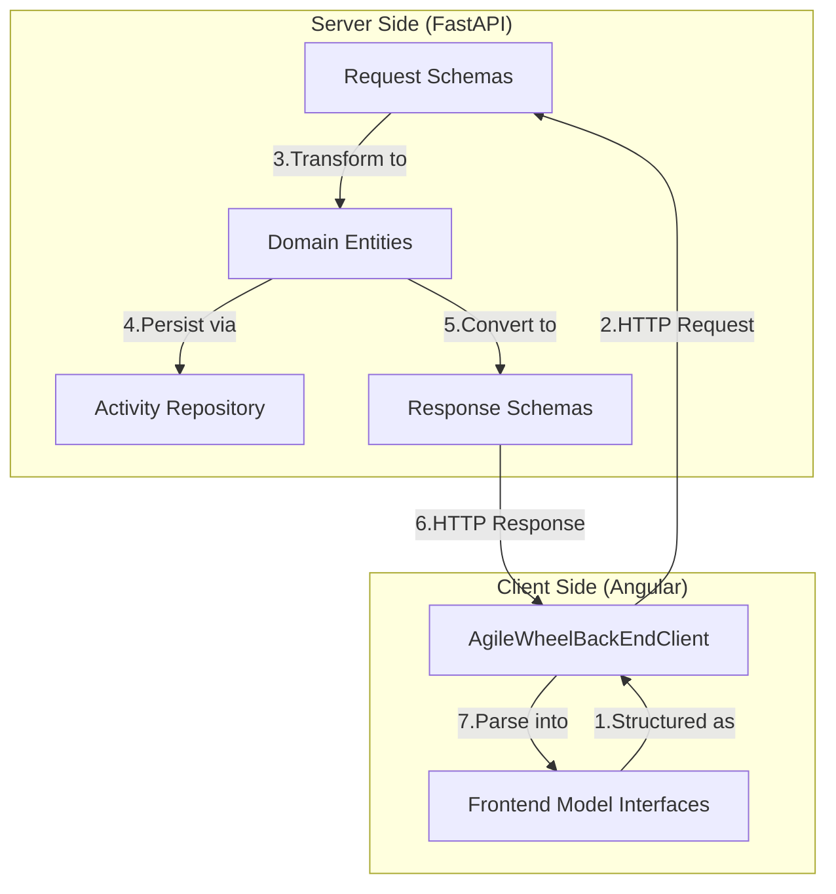
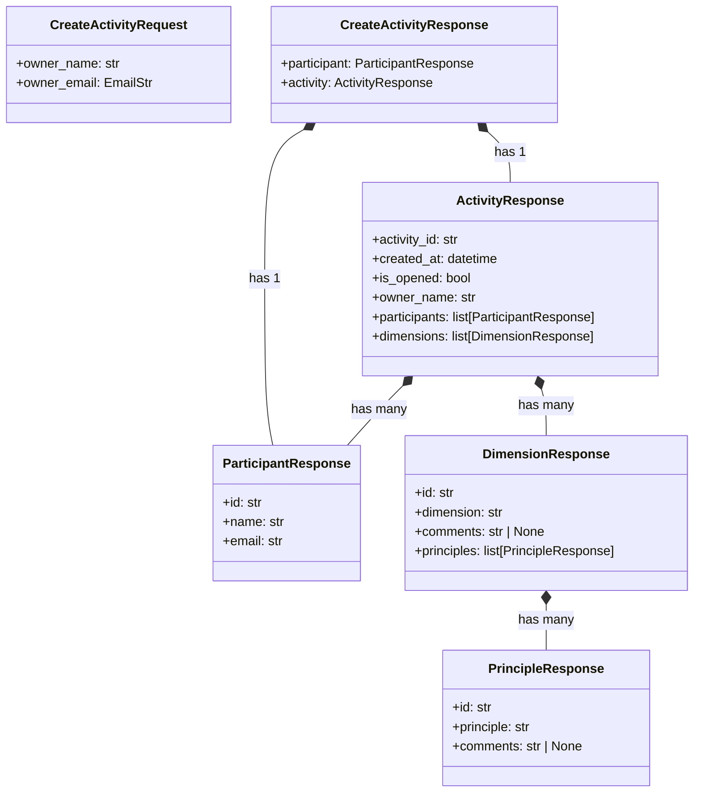
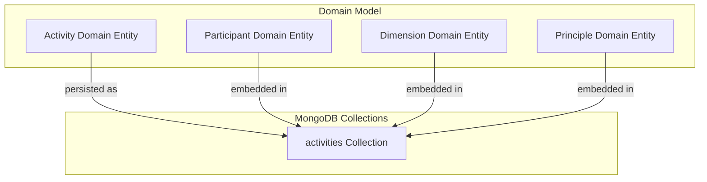
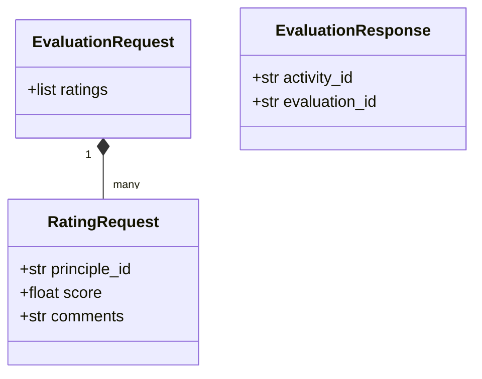

# Modelo de Dados

Essa seção detalha as principais entidades de domínio do sistema Agile Wheel, seus relacionamentos e como elas se mapeiam para modelos de banco de dados. Ele se concentra na representação estrutural de dados nos componentes front-end e back-end. Para obter informações sobre a arquitetura geral do sistema, consulte [Arquitetura do Sistema](index.md).

## 1. Visão geral do Dominio da Entidade

O aplicativo Agile Wheel é criado em torno de um pequeno conjunto de entidades de domínio principais que representam os conceitos essenciais na estrutura de avaliação ágil.

### Diagrama do Dominio da Entidade Core 

--8<-- "./docs/_assets/diagrams/backend-data-model.md"

## 2. Descrições de Entidades

### Activity

Uma `Activity` é o agregado raiz no modelo de domínio.

`Activity` é a entidade central da aplicação, representando uma sessão de avaliação, contendo:

- Metadata (ID, registro de data e hora de criação, status aberto/fechado)
- Uma coleção de `Participants` (incluindo o owner)
- Um conjunto de `Dimension` a serem avaliadas

### Participant

Representa um participante de uma `Activity`. Os participantes são identificados por:

- Unique identifier
- Name
- Email address
- Role (owner ou regular participant)

O primeiro `Participant` normalmente é o owner que cria a atividade.

### Dimension

Representa um conceito importante na estrutura de avaliação da Roda Ágil. Cada Dimensão contém:

- Unique identifier
- Name (o título da dimensão)
- Comentários opcionais
- Uma coleção de princípios que pertencem a esta dimensão

### Principle

Representa uma prática ou critério específico que os participantes avaliam dentro de uma dimensão:

- Unique identifier
- Name (a descrição do princípio)
- Comentários opcionais

## 3. Modelo de Dados Frontend

O frontend utiliza interfaces TypeScript para representar o modelo de dados. Essas interfaces correspondem perfeitamente às entidades de domínio, adaptando-se às necessidades específicas do frontend.

### Interfaces de Entidade Frontend

--8<-- "./docs/_assets/diagrams/frontend-data-model.md"

Essas interfaces são usadas em todos os componentes do frontend:

- `ListParticipantsComponent` consome a `Participant` interface para exibir informações do participante
- `EvaluationWrapperComponent` trabalha com a `Dimension` interface para estruturar as guias de avaliação
- `EvaluationItensComponent` renderiza `Principle` elementos individuais para avaliação

## 4. Entidades de Domínio de Backend

O backend implementa as entidades de domínio como classes Python seguindo princípios de design orientados a domínio, com validação e lógica de negócios apropriadas.

### Classes de Entidade de Domínio de Backend

--8<-- "./docs/_assets/diagrams/backend-data-model.md"

As entidades de domínio de backend contêm lógica de negócios e regras de validação, formando o núcleo do domínio de negócios do aplicativo.

## 5. Fluxo de dados e esquemas de API

A camada de API usa modelos Pydantic para definir esquemas de solicitação e resposta, garantindo validação e serialização adequadas entre o modelo de domínio e os aplicativos cliente.

### Fluxo de solicitação/resposta da API

### Classes de esquema de API principais

A transformação entre entidades de domínio e esquemas de resposta é tratada por meio de métodos de conversão como `from_activity()`, `from_participant()`, etc.

## 6. Modelo de Persistência

O aplicativo Agile Wheel usa o MongoDB como camada de persistência. Entidades de domínio são mapeadas para documentos do MongoDB usando um Mapeador de Objetos e Documentos (ODM).

### Mapeamento de domínio para banco de dados

### Estrutura do documento MongoDB

| Coleção    | Estrutura do documento                                                                | Descrição                                                                |
|------------|---------------------------------------------------------------------------------------|--------------------------------------------------------------------------|
| atividades | `{ _id, activity_id, created_at, is_opened, participants: [...], dimensions: [...] }` | Documento raiz contendo todos os dados de atividade                      |
|            | `participants` (embedded array)                                                       | Conjunto de objetos participantes incorporados no documento de atividade |
|            | `dimensions` (embedded array)                                                         | Conjunto de objetos dimensionais, cada um contendo princípios            |
|            | `dimensions.principles`  (nested embedded array)                                      | Conjunto de objetos principais dentro de cada dimensão                   |

O padrão aggregate root (Activity) é usado, onde todas as entidades relacionadas são armazenadas como documentos incorporados em um único documento MongoDB, simplificando a recuperação de dados e mantendo a consistência.

## 7. Modelo de Dados de Evaluation

O sistema também inclui estruturas para capturar avaliações dos participantes:

Essas estruturas dão suporte à funcionalidade principal do Agile Wheel, permitindo que os participantes avaliem princípios em diferentes dimensões e agreguem essas avaliações para produzir resultados de avaliação.
