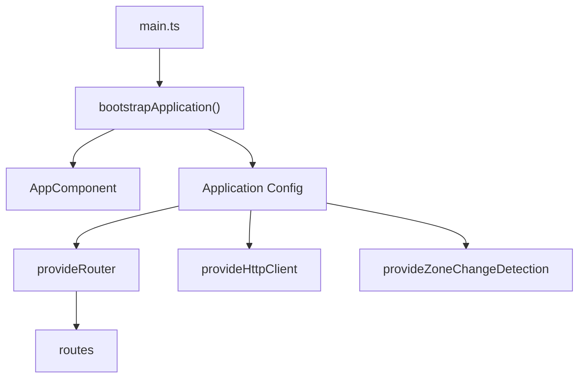
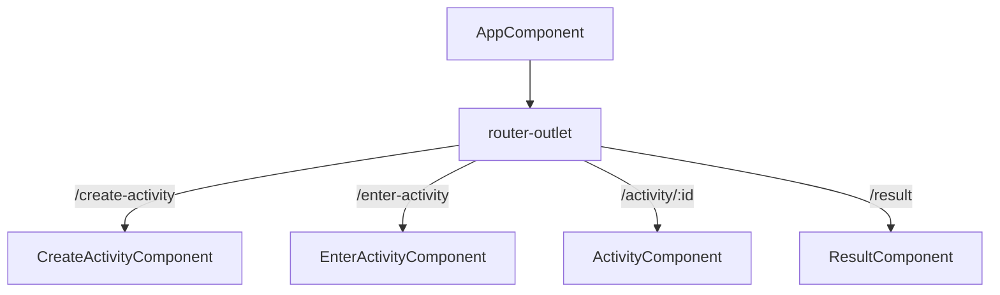
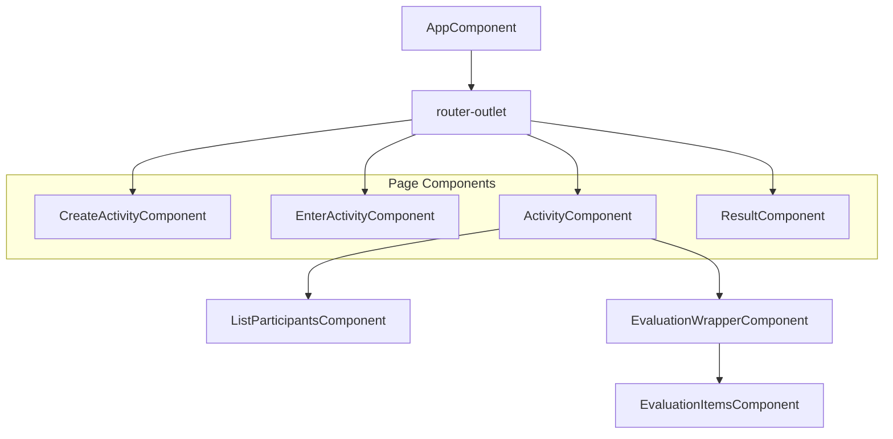
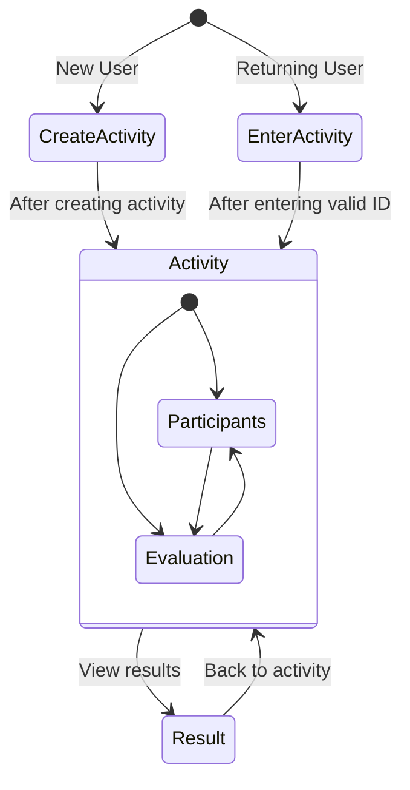
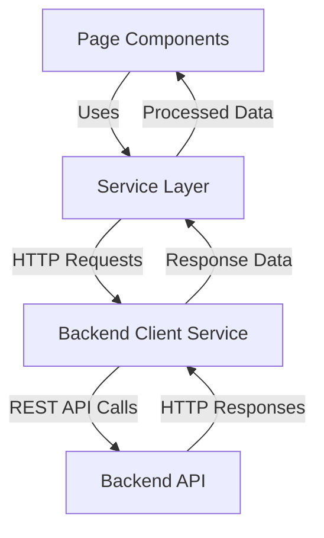

# Arquitetura Frontend

## 1. Objetivo e escopo

Este seção descreve a arquitetura frontend do aplicativo Agile Wheel, detalhando a estrutura do aplicativo Angular, o sistema de roteamento e os principais padrões de design. O frontend serve como interface do usuário para criar, participar de atividades e fazer avaliações de equipes ágeis. Para obter informações sobre sistemas backend e integração de APIs, consulte [Arquitetura de Backend](backend-architecture.md).

## 2. Stack de tecnologia

O frontend do Agile Wheel é construído com:

- **Angular 19**: Estrutura principal para construção de aplicativos de página única
- **Roteador Angular**: Para navegação entre diferentes visualizações
- **Angular Material**: biblioteca de componentes para elementos de interface de usuário consistentes
- **HttpClient**: Para comunicação com a API de backend
- **TailwindCSS**: Para estilo e design responsivo (para mais detalhes, veja [UI Styling and Theming](../3-frontend/ui-styling-theming.md))

## 3. Processo de Bootstrap do aplicativo

O processo de bootstrap do aplicativo segue a abordagem de componente autônomo do Angular:

O aplicativo é inicializado `main.ts` com os seguintes provedores principais:

- Provedor de roteador para navegação
- Provedor HttpClient para comunicação de API
- Configuração de detecção de alterações do Zone.js para desempenho

## 4. Estrutura da aplicação

### Componente Raiz e Roteamento

O aplicativo começa com o `AppComponent` como componente raiz, que serve principalmente como um contêiner para a saída do roteador. A saída do roteador carrega componentes dinamicamente com base na rota atual.

### Hierarquia de Componentes

O frontend do Agile Wheel segue uma estrutura de componentes hierárquica que se alinha aos principais fluxos de usuários do aplicativo:

A estrutura hierárquica reflete os principais fluxos de usuários do aplicativo:

1. Criando uma nova atividade
2. Participando de uma atividade existente
3. Fazendo uma avaliação em uma atividade
4. Visualizando os resultados da avaliação

## 5. Sistema de roteamento

O Roteador Angular é configurado `app.routes.ts` e gerencia a navegação entre diferentes visualizações. O aplicativo possui as seguintes rotas:

| Path              | Component                     | Description                                 |
|-------------------|-------------------------------|---------------------------------------------|
| ''                | Redirect to 'create-activity' | Default route                               |
| 'create-activity' | CreateActivityComponent       | Create a new activity                       |
| 'enter-activity'  | EnterActivityComponent        | Join an existing activity                   |
| 'activity/:id'    | ActivityComponent             | View and participate in a specific activity |
| 'result'          | ResultComponent               | View evaluation results                     |
| '**'              | Redirect to 'create-activity' | Catch-all route for invalid URLs            |

O roteador é configurado como um provedor no processo de bootstrap do aplicativo, tornando-o disponível em todo o aplicativo.

## 6. Key Navigation Flows

O sistema de roteamento do aplicativo suporta vários fluxos de usuários principais:

Cada estado de navegação corresponde a um componente específico que lida com as interações relevantes do usuário e a exibição de dados.

## 7. Data Flow Architecture

O frontend implementa uma arquitetura de fluxo de dados baseada em serviço para se comunicar com o backend:

Esse padrão separa as preocupações e permite:

- Lógica de acesso a dados reutilizável
- Comunicação de API centralizada
- Tratamento consistente de erros
- Transformação de dados entre modelos de API e componentes

O serviço de cliente de backend encapsula toda a lógica de solicitação HTTP, manipulando:

- Construção de URL de API
- Cabeçalhos HTTP
- Serialização de solicitação/resposta
- Tratamento de erros

## 8 Padrões de Estrutura de Componentes

A arquitetura do frontend segue vários padrões de componentes Angular:

1. **Componentes da página**: componentes de nível superior carregados pelo roteador (CreateActivity, EnterActivity, Activity, Result)
2. **Componentes de recursos**: componentes reutilizáveis ​​que implementam recursos específicos (ListParticipants, EvaluationWrapper, EvaluationItems)
3. **Componentes de layout**: componentes que controlam a estrutura do layout

Cada componente normalmente segue esta estrutura interna:

- Classe de componente: contém a lógica do componente
- Modelo de componente: define a IU
- Estilo específico do componente (quando necessário)

Essa separação permite um código sustentável e uma separação clara de preocupações.

## 9. Resumo

A arquitetura do frontend do Agile Wheel segue as melhores práticas do Angular com:

1. Uma estrutura baseada em componentes que mapeia os fluxos de usuários do aplicativo
2. Um sistema de roteamento bem definido para navegação entre diferentes visualizações
3. Uma camada de serviço para comunicação com o backend
4. Separação de preocupações entre apresentação e acesso a dados

Essa arquitetura dá suporte aos principais recursos do aplicativo, mantendo a organização do código e fornecendo uma base para melhorias futuras.