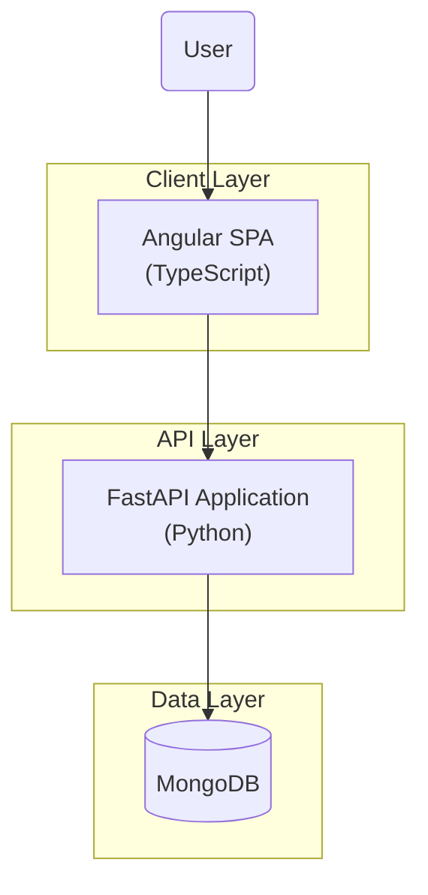
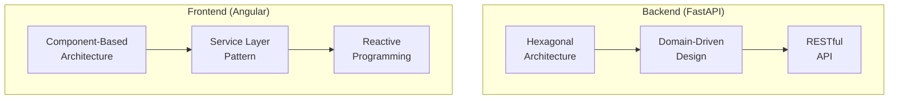
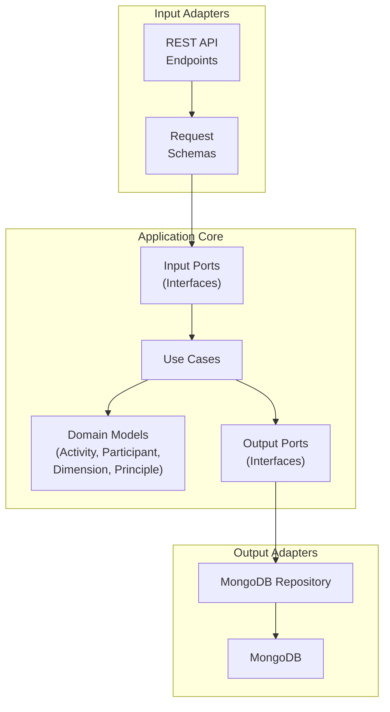
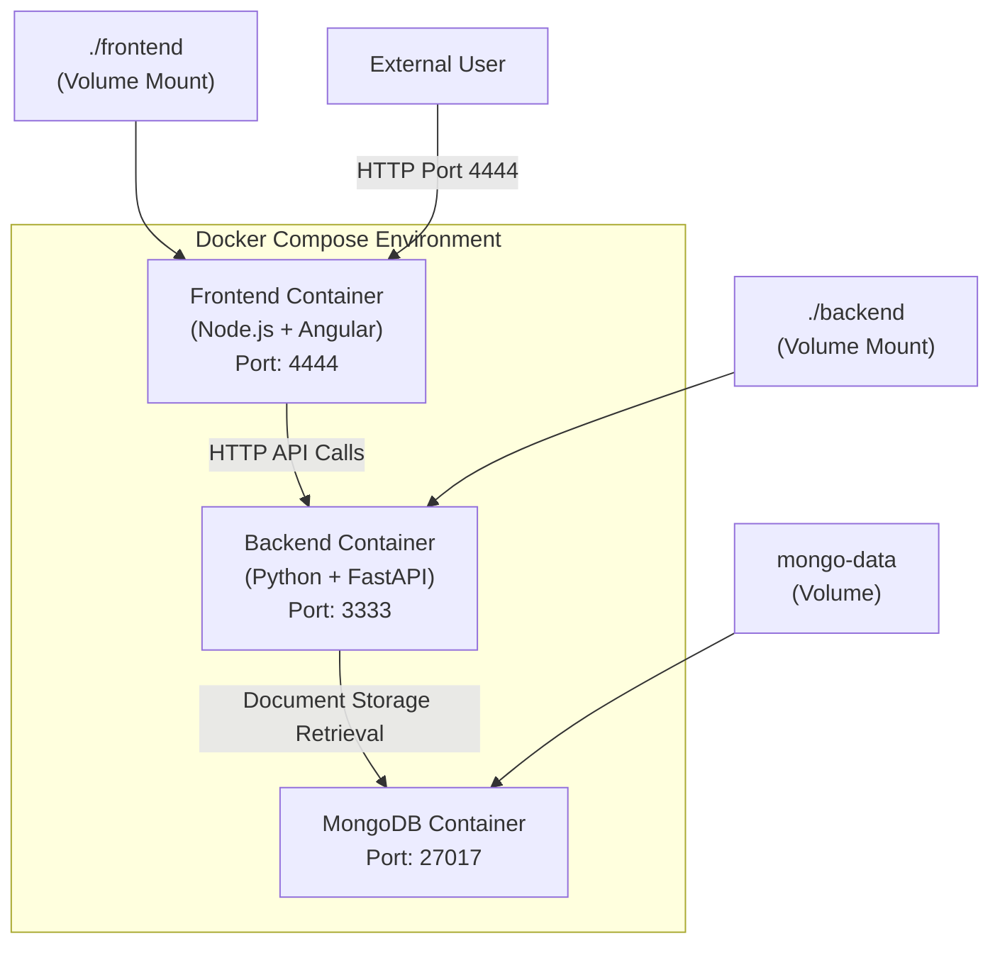
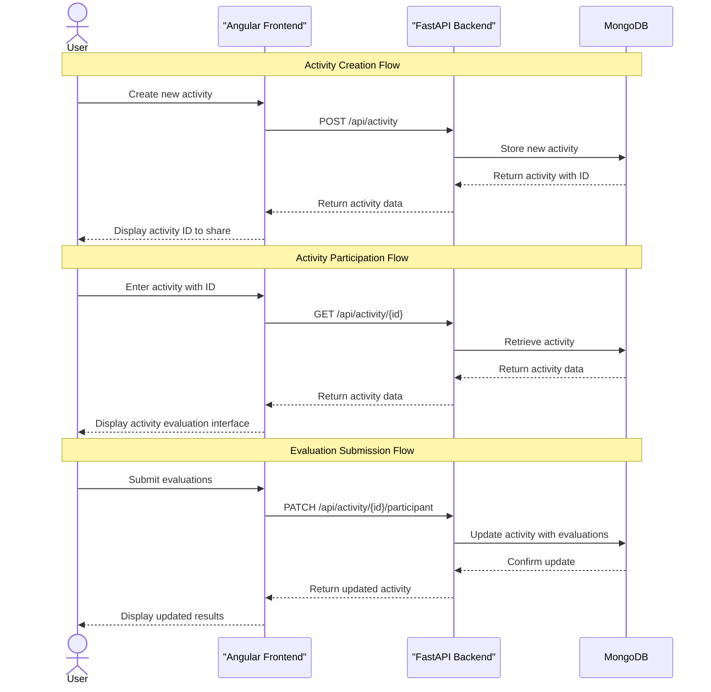

# Arquitetura do Sistema

Este seção fornece uma visão geral da arquitetura do conjunto de componentes do Agile Wheel, explicando suas interações e implementação técnica. Ele aborda a estrutura de alto nível, a stack de tecnologias e os padrões arquitetônicos utilizados em toda a aplicação. Para obter informações detalhadas sobre componentes específicos, consulte as respectivas seções: [Arquitetura Frontend](frontend-architecture.md), [Arquitetura Backend](backend-architecture.md) e [Modelo de Dados](data-model.md).

## 1. Visão geral

O aplicativo Agile Wheel é uma plataforma web moderna projetada para facilitar a avaliação da maturidade ágil para equipes. Ele implementa um padrão de arquitetura hexagonal (portas e adaptadores) com uma separação clara entre componentes front-end e back-end.

### Diagrama: High-Level System Architecture



## 2. Stack de tecnologia

O aplicativo Agile Wheel usa uma pilha de tecnologia moderna projetada para escalabilidade, manutenibilidade e experiência do desenvolvedor.

| Componente               | Tecnologia                       | Descrição                                                                |
|--------------------------|----------------------------------|--------------------------------------------------------------------------|
| Front-end                | Angular 19                       | Aplicação de página única com TypeScript e modelo de programação reativa |
| Backend                  | FastAPI (Python 3.12)            | API RESTful com tratamento de solicitações assíncronas                   |
| Banco de dados           | MongoDB 8.0                      | Banco de dados de documentos NoSQL para armazenamento flexível de dados  |
| Documentação Geral      | MkDocs                  | Documentação manual de todo o projeto                      |
| Documentação da API      | Swagger/OpenAPI                  | Documentação automática de API e interface de teste de requisição                      |
| Gerenciamento de Pacotes | Poetry (Backend), NPM (Frontend) | Gerenciamento de dependências para cada componente                       |
| Conteinerização          | Docker + Docker Compose          | Implantação baseada em contêiner para ambientes consistentes             |
| CI/CD                    | Ações do GitHub + SonarCloud     | Integração contínua e verificações de qualidade de código                |

## 3. Padrões arquitetônicos

### Diagrama: Core Architectural Patterns



### Arquitetura Hexagonal (Backend)

O backend segue o padrão de arquitetura Hexagonal (Ports and Adapters), que separa a lógica de negócios principal das preocupações externas:



## 4. Conteinerização e Implantação

O aplicativo é conteinerizado usando o Docker com uma configuração multicontêiner orquestrada pelo Docker Compose. Essa abordagem garante ambientes de desenvolvimento e produção consistentes.

### Diagrama: Containerization Architecture



A configuração da conteinerização inclui:

1. **Contêiner de front-end**:
    - Desenvolvimento: ambiente Node.js com hot-reloading
    - Produção: Nginx servindo arquivos estáticos Angular
    - Mapeamento de portas padrão: 4444:80

2. **Contêiner de backend**:
    - Ambiente Python 3.12 com FastAPI e dependências
    - Servidor Uvicorn ASGI com hot-reloading em desenvolvimento
    - Mapeamento de portas padrão: 3333:8000

3. **Contêiner MongoDB**:
    - MongoDB 8.0.8 para persistência de dados
    - Montagem de volume para persistência de dados
    - Mapeamento de portas: 27017:27017

A configuração do Docker Compose gerencia a orquestração desses contêineres, incluindo variáveis ​​de ambiente, mapeamentos de portas, montagens de volume e dependências de contêineres.

## 5. Fluxo de Dados

### Diagrama: System Data Flow



## 6. Interface com Sistemas Externos

O aplicativo Agile Wheel é basicamente autocontido, sem dependências diretas de APIs ou serviços externos. As principais interfaces são:

1. **Do navegador para o front-end**: interação do usuário por meio de navegadores da web

2. **Frontend para Backend**: chamadas de API HTTP do Angular para FastAPI

3. **Backend-to-Database**: Persistência de dados via conexão MongoDB

### Configuração CORS

A API de backend é configurada para permitir solicitações entre origens de origens especificadas, conforme definido no arquivo Docker Compose:

```
ALLOWED_ORIGINS=http://localhost:4200,http:...
```

## 7. Configuração do ambiente

Os componentes front-end e back-end usam variáveis ​​de ambiente para configuração, que são definidas no arquivo Docker Compose e podem ser substituídas em tempo de execução.

### Variáveis ​​de ambiente de backend


| Variável           | Padrão                     | Descrição                                                          |
|--------------------|----------------------------|--------------------------------------------------------------------|
| INTERNAL_PORT      | 8000                       | Porta na qual o aplicativo FastAPI é executado dentro do contêiner |
| DB_HOST            | mango                      | Nome do host do MongoDB (nome do contêiner na rede Docker)         |
| DB_PORT           | 27017                      | Porta MongoDB                                                      |
| ALLOWED_ORIGINS | http://localhost:4200,http:... | CORS permitiu origens para solicitações de API                     |


### Variáveis ​​de ambiente de frontend

| Variável      | Padrão | Descrição                                                          |
|---------------|--------|--------------------------------------------------------------------|
| INTERNAL_PORT | 80     | Porta na qual o aplicativo Angular é executado dentro do contêiner |

## 8. Considerações sobre desenvolvimento e produção

A arquitetura suporta ambientes de desenvolvimento e produção:

### Ambiente de Desenvolvimento

- Montagens de volume para recarga de código ativo
- Capacidades de recarga dinâmica no frontend e no backend
- Alvos específicos de desenvolvimento em Dockerfiles

### Ambiente de Produção

- Compilações Docker de vários estágios otimizadas para produção
- Arquivo estático servindo para o frontend
- Configuração de backend otimizada

O sistema foi projetado para ser escalável por meio do dimensionamento horizontal dos contêineres front-end e back-end, com o MongoDB suportando replicação para alta disponibilidade.

