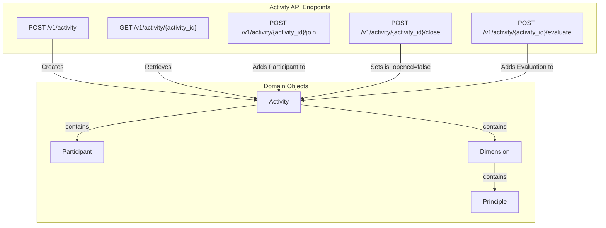
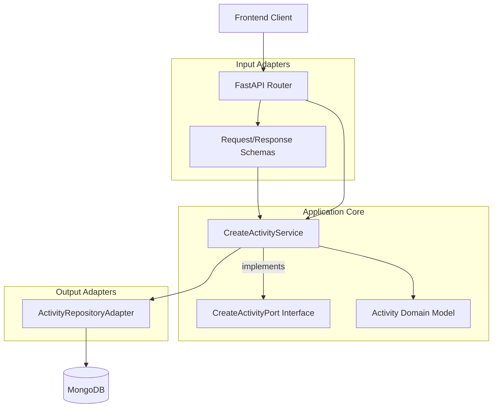
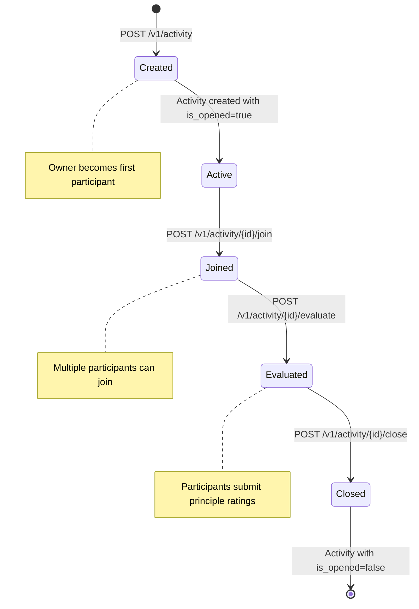
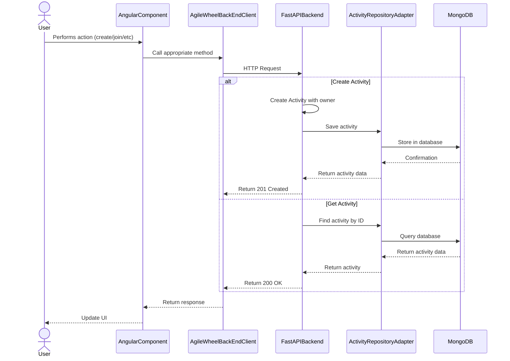

# Contexto - Activity

A API de Activity fornece um conjunto de endpoints para gerenciar atividades dentro do aplicativo Agile Wheel. Isso inclui criar novas atividades, recuperar detalhes das atividades, unir atividades existentes e gerenciar o ciclo de vida das atividades. Este documento detalha os endpoints disponíveis, seus formatos de solicitação/resposta e a funcionalidade subjacente.

Para obter informações sobre a arquitetura geral do backend, consulte [Arquitetura do backend](index.md).

## 1. Visão geral dos endpoints da API

A API de Activity faz parte do backend do FastAPI e fornece as seguintes funcionalidades principais:

- Criando novas atividades com um proprietário
- Recuperando detalhes da atividade
- Participar de atividades existentes como participante
- Atividades de encerramento
- Envio de avaliações para princípios

## 2. API Implementation Architecture

A API de atividade segue um padrão de arquitetura hexagonal, separando a camada de API das camadas de domínio e persistência:

## 3. Ciclo de vida - Activity

O diagrama a seguir ilustra o ciclo de vida de uma atividade por meio dos pontos de extremidade da API:

## 4. Data Flow: Frontend to Backend

Este diagrama mostra como o frontend interage com a API de atividade:

## 5. Validation e Error Handling

A API implementa vários mecanismos de validação:

1. **Validação de Esquema de Solicitação**: Modelos Pydantic validam solicitações recebidas

    - Validação do comprimento do nome (mínimo 3 caracteres)
    - Validação do formato de e-mail
    - Verificação de campo obrigatória

2. **Validação de Existência de Atividade**: Verifica se a atividade solicitada existe

    - Retorna respostas de erro apropriadas quando a atividade não é encontrada

3. **Validação do participante**: verifica se o participante pertence à atividade

    - Validação do cabeçalho de ID do participante

## 6. Frontend Integration

O frontend acessa a Activity API por meio do serviço `AgileWheelBackEndClient`, que fornece métodos wrapper para comunicação HTTP:

- `get<T>(endpoint, headers?)`: Para requisições GET
- `post<T>(endpoint, body, headers?)`: Para requisições POST
- `put<T>(endpoint, body, headers?)`: Para requisições PUT
- `delete<T>(endpoint, headers?)`: Para requisições DELETE

Os principais serviços de front-end que interagem com a Activity API incluem o `ValidateActivityService`, que valida a existência da atividade e os direitos de acesso dos participantes.

## 7. Activity Model

A API Activity manipula e retorna objetos Activity com a seguinte estrutura:

| Field        | Type     | Description                                |
|--------------|----------|--------------------------------------------|
| activity_id  | string   | Unique identifier for the activity         |
| created_at   | datetime | Timestamp when the activity was created    |
| is_opened    | boolean  | Indicates if the activity is still open    |
| owner_name   | string   | Name of the activity owner                 |
| participants | array    | List of participants (including the owner) |
| dimensions   | array    | List of dimensions with their principles   |
