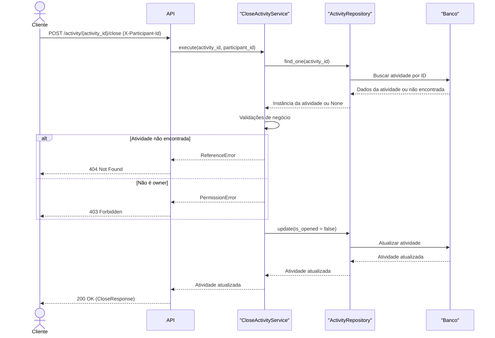

# POST /activity/{activity\_id}/close

Encerra uma atividade do Agile Wheel (muda o status `is_opened` para `false`). Apenas o owner pode executar esta operação.

## Descrição

Este endpoint encerra uma atividade em andamento. Depois de encerrada, não é mais possível submeter avaliações ou alterações nessa atividade.

A operação deve ser chamada via método POST para `/activity/{activity_id}/close`, onde:

- **Path** `activity_id` (UUID, obrigatório): Identificador da atividade, corresponde ao campo id da entidade Activity.

- **Header** `X-Participant-Id` (UUID, obrigatório): Identificador do participante solicitante, corresponde ao campo id da entidade Participant.

### Regras de negócio

* Apenas o owner pode encerrar a atividade. O owner é identificado pelo campo `role == "owner"` na lista de participantes.
* Caso a atividade não exista, retorna HTTP 404.
* Caso o participante não seja o owner, retorna HTTP 403.
* Ao fechar, o campo `is_opened` é alterado para `false` e a entidade atualizada é persistida e retornada.

## Diagrama de Sequência



## Respostas

| HTTP Code | Descrição                | Corpo                                                |
| --------- | ------------------------ | ---------------------------------------------------- |
| 200       | Sucesso                  | `{ "activity": { ... } }`                            |
| 403       | Permissão negada         | `{"error": "Only the owner can close the activity"}` |
| 404       | Atividade não encontrada | `{"error": "Activity not found for update"}`         |

## Exemplo de Requisição

```http
curl -X 'POST' \
  '{HOST}/v1/activity/123e4567-e89b-12d3-a456-426614174000/close' \
  -H 'accept: application/json' \
  -H 'X-Participant-Id: 123e4567-e89b-12d3-a456-426614174999'
```


## Exemplo de Resposta

```json
{
  "activity": {
    "app_id": "e54e063e-...-427a-a5a0-...",
    "is_opened": false,
    "created_at": "2025-06-08T14:30:00.000Z",
    "participants": [ ... ],
    "dimensions": [ ... ],
    "evaluations": [ ... ]
  }
}
```

### Exemplo de Resposta (Permissão negada)

```json
{
  "error": "Only the owner can close the activity"
}
```

### Exemplo de Resposta (Atividade não encontrada)

```json
{
  "error": "Activity not found for update"
}
```
