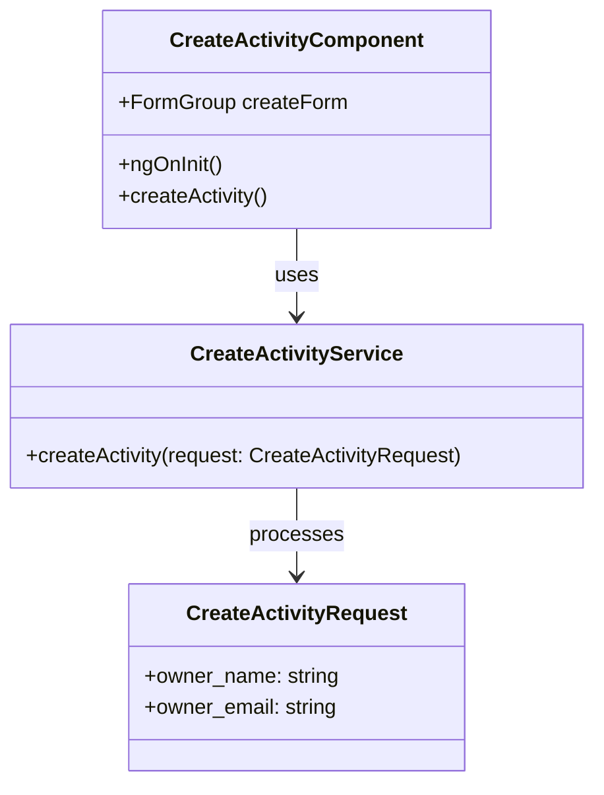
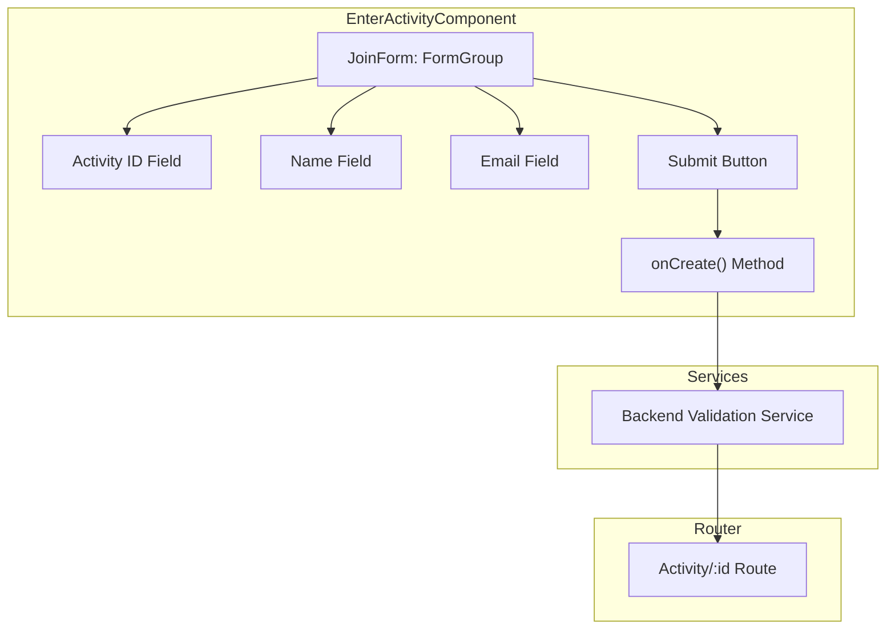
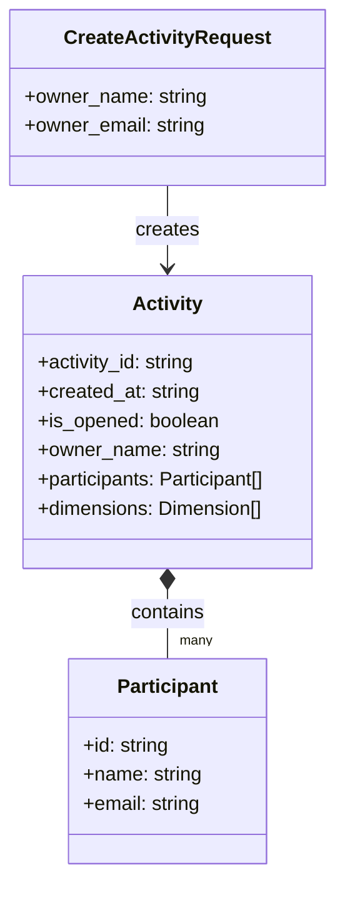
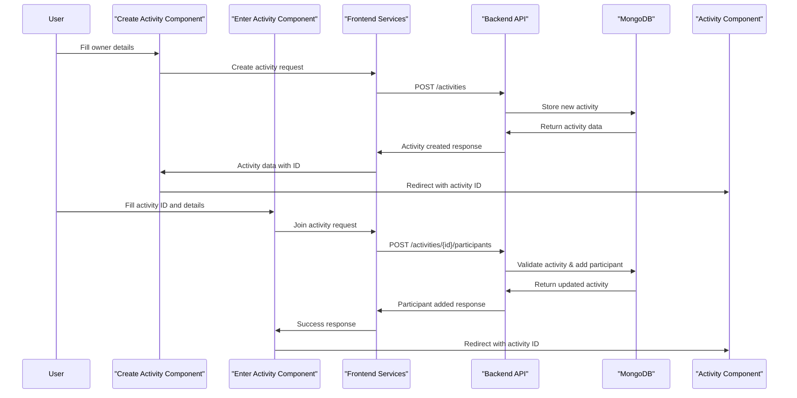

# Activity - Criação e entrada

## Objetivo e escopo

Esta página documenta a funcionalidade de criação e entrada de atividades no aplicativo Agile Wheel. Ela aborda os componentes voltados para o usuário, o fluxo de dados e a implementação técnica de como os usuários criam novas atividades de avaliação e se unem às existentes. Esta é a etapa inicial do processo Agile Wheel antes do início da avaliação.

Para obter informações sobre o processo de avaliação real dentro de uma atividade, consulte [Componentes de Avaliação](component-evaluation.md).

## Visão geral

A funcionalidade de Criação e Entrada de Atividades representa os pontos de entrada para o aplicativo Agile Wheel, fornecendo aos usuários dois caminhos distintos:

- **Criar uma nova atividade** - Para facilitadores ou líderes de equipe que iniciam uma nova avaliação
- **Insira uma atividade existente** - Para participantes que ingressam em uma avaliação que já foi criada

## Component - Create Activity

O componente Criar Atividade fornece uma interface de formulário para os usuários iniciarem uma nova atividade da Roda Ágil. Este componente é o ponto de partida para facilitadores de avaliação.

### Estrutura do componente



### Interface do usuário

O formulário Criar atividade contém:

- **Campo de nome** - Entrada obrigatória para o nome do proprietário da atividade
- **Campo de e-mail** - Entrada obrigatória com validação de e-mail
- **Botão Criar atividade** - Envia o formulário (desativado até que o formulário seja válido)
- **Navegação alternativa** - Link para inserir uma atividade existente
![Criar formulário de atividade]

O componente é implementado como um componente Angular autônomo com elementos de interface de usuário de material e formulários reativos.

```ts
// Key form implementation
this.createForm = this.formBuilder.group({
  name: ['', Validators.required],
  email: ['', [Validators.required, Validators.email]],
});
```

### Fluxo de Criação

Quando um usuário envia o formulário:

1. A validação do formulário é verificada
2. Os detalhes do proprietário são extraídos do formulário
3. `CreateActivityService` é chamado com os detalhes do proprietário
4. O serviço se comunica com a API de backend
5. Após a criação bem-sucedida, o usuário é redirecionado para a página de atividades

O componente também verifica as atividades existentes armazenadas no localStorage e redireciona automaticamente se encontradas.

```ts
// Activity creation method
createActivity(): void {
  if (this.createForm.invalid) return;
  
  const owner: CreateActivityRequest = {
    owner_email: this.createForm.value.email,
    owner_name: this.createForm.value.name
  };

  this.createActivityService.createActivity(owner);
}
```

## Component - Enter Activity

O componente Entrar na atividade permite que os participantes participem de atividades existentes usando uma ID de atividade fornecida pelo criador da atividade.

### Estrutura do componente



### Interface do usuário

O formulário Enter Activity contém:

- **Campo ID da atividade** - Entrada obrigatória para o identificador da atividade
- **Campo Nome** - Entrada obrigatória para o nome do participante
- **Campo de e-mail** - Entrada obrigatória com validação de e-mail
- **Botão Inserir atividade** - Envia o formulário (desativado até que o formulário seja válido)
- **Navegação alternativa** - Link para criar uma nova atividade

O formulário usa componentes do Angular Material e formulários reativos para validação e coleta de dados.

### Fluxo de Entrada

Quando um participante envia o formulário:

1. A validação do formulário é verificada
2. O ID da atividade e os detalhes do participante são extraídos do formulário
3. O serviço de backend valida se a atividade existe e está aberta
4. O participante é adicionado à atividade
5. O usuário é redirecionado para a página de atividade com o ID da atividade

## Modelos de Dados e Interação de API

### Modelo de Dados de Criação de Atividades



### Interações de API

As atividades são criadas e unidas por meio de endpoints de API que se conectam ao aplicativo de back-end. Os componentes de front-end usam serviços dedicados para lidar com estas chamadas de API:

1. **Criar atividade**: publica detalhes do proprietário para criar uma nova atividade
2. **Inserir atividade**: publica detalhes do participante para ingressar em uma atividade existente
3. **Validar atividade**: verifica se uma atividade existe e está aberta para participação

Após a criação ou adesão bem-sucedida, um objeto de atividade normalmente é armazenado no localStorage para manter a sessão do usuário e permitir o retorno à atividade.

## Diagrama de fluxo completo



## Integração com o componente de atividade

Após a criação ou adesão, os usuários são direcionados ao componente Atividade, que exibe:

1. Uma lista de participantes mostrando todas as pessoas que se juntaram à atividade
2. A interface de avaliação com dimensões e princípios para avaliar

O componente Atividade recupera e exibe dados para o ID de atividade específico que foi criado ou associado.

```ts
// Example of localStorage usage for activity persistence
ngOnInit(): void {
  const activity = localStorage.getItem('activity');

  if (activity) {
    const activityData:Activity = JSON.parse(activity);
    this.router.navigate(['/activity', activityData.activity_id]);
  }
}
```

## Conclusão

A funcionalidade de criação e entrada de atividades fornece dois caminhos de entrada críticos para o aplicativo Agile Wheel:

1. **Criar atividade** - Para iniciadores/facilitadores de avaliação
2. **Entrar na atividade** - Para participantes da avaliação

Esses componentes gerenciam as interações iniciais do usuário, validações de formulários e comunicações de API necessárias para estabelecer novas atividades de avaliação ou ingressar em atividades existentes. Após criar ou ingressar em uma atividade com sucesso, os usuários prosseguem para o componente Atividade, onde podem visualizar os participantes e concluir as avaliações.