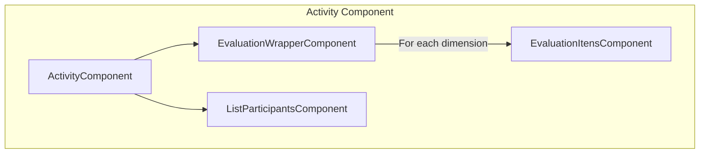
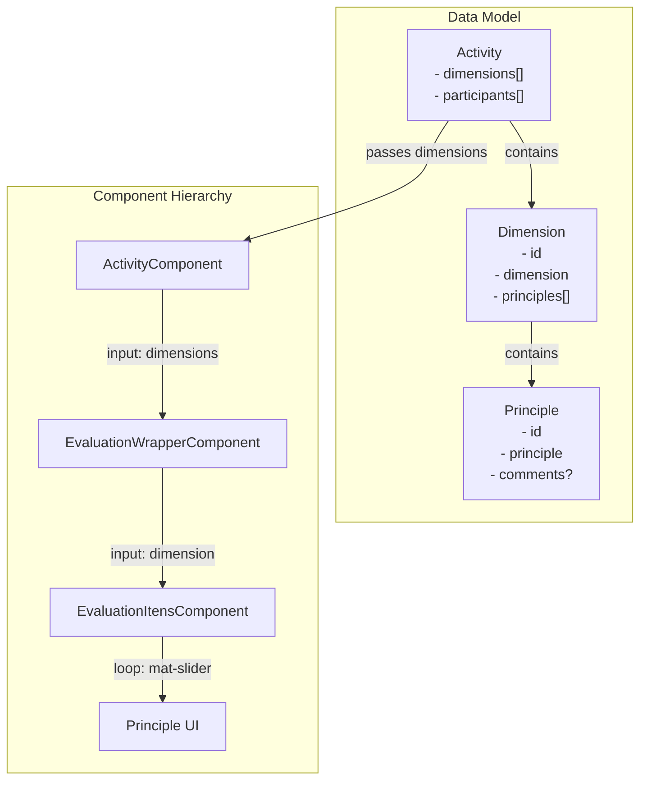
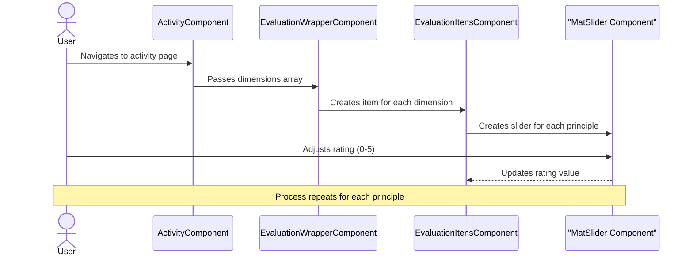
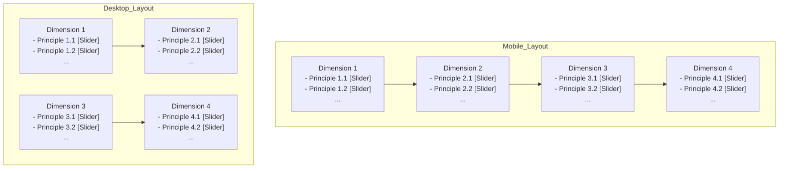
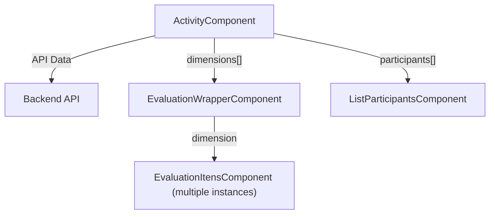

# Componentes - Evaluation

## Objetivo e escopo

Este documento detalha os componentes de avaliação do aplicativo Roda Ágil que permitem aos participantes classificar dimensões e princípios. Esses componentes formam os principais elementos interativos onde os usuários fornecem suas classificações de avaliação para vários princípios ágeis. Para obter informações sobre como criar ou participar de atividades, consulte [Criação e Entrada de Atividades](activity-creation-entry.md) e, para obter detalhes sobre como os participantes são gerenciados, consulte [Gerenciamento de Participantes](participants.md).

## Visão geral do componente

A interface de avaliação no Agile Wheel consiste em dois componentes principais organizados em uma estrutura hierárquica, juntamente com sua integração na visão mais ampla da Atividade.



## Estrutura de componentes e fluxo de dados

Os componentes de avaliação são estruturados para lidar com a natureza hierárquica da estrutura da Roda Ágil, que consiste em dimensões e princípios. O diagrama a seguir ilustra o fluxo de dados do modelo de atividades por meio da hierarquia de componentes:



## Componente Wrapper Evaluation

O `EvaluationWrapperComponent` serve como um contêiner para múltiplas instâncias de `EvaluationItensComponent`. Ele recebe uma matriz de objetos `Dimension` e renderiza um item de avaliação para cada dimensão.

### Principais características:

- Recebe dados de dimensões via decorador @Input()
- Organiza dimensões em um layout de grade responsivo (coluna única em dispositivos móveis, duas colunas em telas maiores)
- Itera por cada dimensão e delega a renderização aos componentes filhos

### Detalhes da implementação:


```ts
@Input() dimensions!: Dimension[];
```

O modelo cria uma grade responsiva e itera pelas dimensões:

```html
<div class="grid grid-cols-1 md:grid-cols-2 gap-6">
    <app-evaluation-itens 
    *ngFor="let dimension of dimensions"
    [dimension]="dimension"/>
</div>
```

## Componente Itens Evaluation

O `EvaluationItensComponent` (observe que a grafia é "Itens" e não "Items" na base de código) é responsável por renderizar uma única dimensão e todos os seus princípios. Cada princípio inclui um controle deslizante para classificação em uma escala de 0 a 5.

### Principais características:

- Recebe um objeto unidimensional via `@Input()` decorador
- Exibe o nome da dimensão como um título
- Renderiza uma lista de princípios com controles deslizantes de classificação
- Utiliza controles deslizantes do Material Design para a interface de classificação

### Detalhes da implementação:

```ts
@Input() dimension!: Dimension;
```

O modelo renderiza a dimensão e seus princípios:

```html
<div class="bg-gray-50 rounded-xl p-4 flex flex-col ring-1 ring-gray-900/10">
  <h2 class="mb-2 text-lg font-semibold text-gray-900">
    {{ dimension.dimension }}
  </h2>
  <ul class="space-y-1 flex-1">
    <li *ngFor="let label of dimension.principles" class="flex items-center justify-between">
      <span class="text-sm">{{ label.principle }}</span>
      <mat-slider [min]="0" [max]="5" discrete>
        <input matSliderThumb>
      </mat-slider>
    </li>
  </ul>
</div>
```


## Modelo de Dados

Os componentes de avaliação dependem das seguintes entidades do modelo de dados:

| Entity    | Properties                                                          | Description                                |
|-----------|---------------------------------------------------------------------|--------------------------------------------|
| Dimension | id: stringdimension: stringcomments?: stringprinciples: Principle[] | A category of principles to be evaluated   |
| Principle | id: stringprinciple: stringcomments?: string                        | An individual principle within a dimension |


## Fluxo de interação do usuário

O diagrama a seguir ilustra como os usuários interagem com os componentes de avaliação:



## Visual Layout

Os componentes de avaliação são dispostos em um padrão de grade responsivo:



## Implementação Técnica

### Componentes de materiais angulares

Os componentes de avaliação utilizam vários componentes do Angular Material para uma interface de usuário consistente:

| Component | Purpose                                           |
|-----------|---------------------------------------------------|
| MatSlider | Provides the 0-5 rating slider for each principle |
| MatCard   | Used for containing dimension content             |
| MatButton | For action buttons                                |
| MatIcon   | For displaying icons                              |


### Estilo

Os componentes usam uma combinação de classes utilitárias TailwindCSS e estilo Angular Material:

- Fundos de cartão usados `bg-gray-50` ​​com cantos arredondados (`rounded-xl`)
- Fronteiras sutis com `ring-1 ring-gray-900/10`
- Espaçamento responsivo com os utilitários de preenchimento e margem do Tailwind
- Tipografia com classes de tamanho e peso de texto do Tailwind

## Integração com a página de atividades

Os componentes de avaliação fazem parte da página de Atividade, que também inclui o gerenciamento de participantes. A página de Atividade recebe dados do backend e os repassa aos componentes apropriados.



## Resumo

Os componentes de avaliação do Agile Wheel oferecem uma interface estruturada e intuitiva para classificar os princípios ágeis em diferentes dimensões. O design hierárquico segue a estrutura do framework Agile Wheel, com dimensões contendo múltiplos princípios. Cada princípio é classificado por meio de um controle deslizante discreto de 0 a 5, permitindo que os participantes forneçam feedback quantitativo sobre a agilidade de sua equipe.