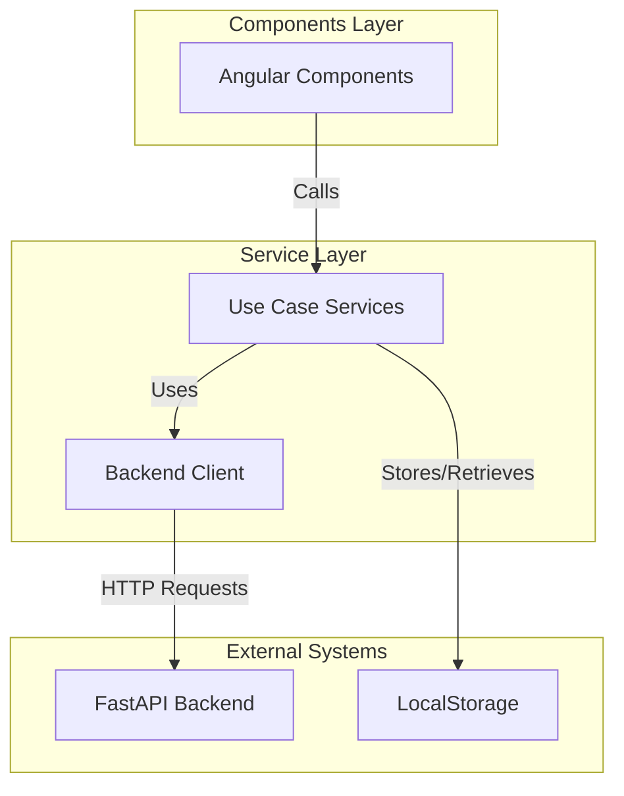
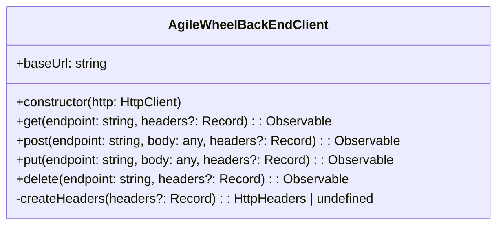
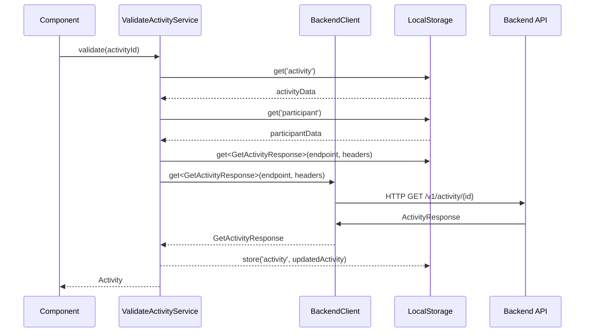
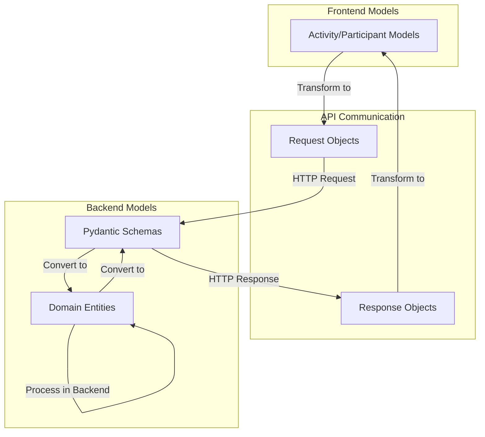
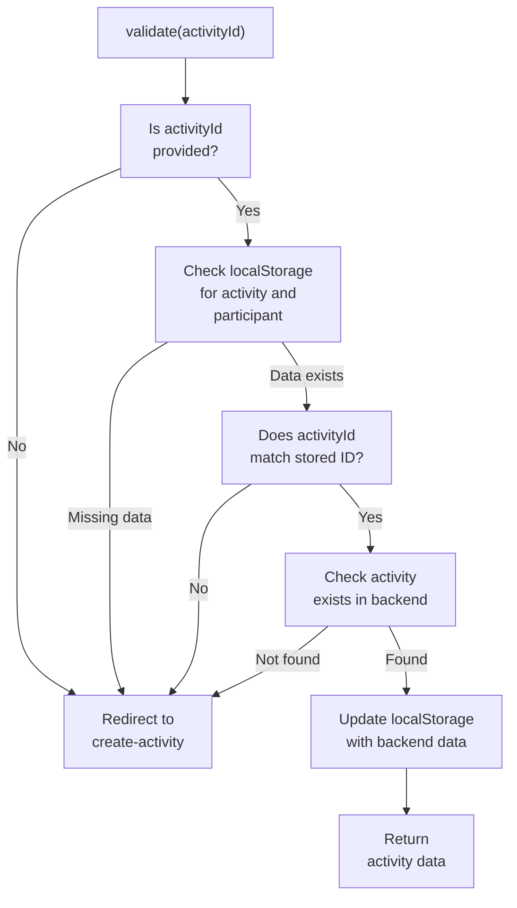

# Frontend Services and Data Flow

Este documento explica a arquitetura do serviço frontend e os padrões de fluxo de dados no aplicativo Agile Wheel. Ele aborda como o frontend Angular se comunica com a API do backend, a organização dos serviços, a transformação de dados e as estratégias de cache. Para obter informações sobre os componentes frontend e suas interações com a interface do usuário, consulte [Componentes de Atividade](component-activity.md) e [Componentes de Avaliação](component-evaluation.md).

## Core Service Architecture

O frontend Agile Wheel implementa uma arquitetura orientada a serviços que separa os componentes da interface do usuário da lógica de negócios e da comunicação com a API. A camada de serviço segue uma hierarquia clara:



### Backend Client Service

Este `AgileWheelBackEndClient` é o serviço principal responsável por toda a comunicação HTTP com a API de backend. Ele fornece uma interface simplificada para fazer chamadas de API com cabeçalhos e tratamento de erros apropriados.



Principais recursos do Backend Client:

1. Centraliza todos os endpoints da API com uma URL base comum
2. Fornece métodos HTTP digitados (obter, postar, colocar, excluir) que retornam Observables RxJS
3. Lida com a criação de cabeçalhos HTTP e configuração de solicitações
4. Encapsula o serviço Angular HttpClient

### Use Case Services

Os serviços de caso de uso implementam fluxos lógicos de negócios específicos e atuam como intermediários entre os componentes e o cliente de back-end. Eles lidam com a transformação de dados, validação e gerenciamento de estado.

Exemplos de serviços incluem:

- **`ValidateActivityService`**: Valida a existência da atividade e o acesso do usuário
- **`CreateActivityService`**: Lida com o fluxo de criação de atividades
- **`EnterActivityService`**: Gerencia o processo de adesão a uma atividade existente

## Data Flow Patterns

O aplicativo segue padrões consistentes de fluxo de dados entre diferentes recursos. O diagrama a seguir ilustra o fluxo de dados típico para validar e acessar uma atividade:



### LocalStorage Caching Strategy

O aplicativo utiliza localStorage para armazenamento em cache do lado do cliente de estados importantes do aplicativo:

1. Após chamadas de API bem-sucedidas, os dados da entidade são armazenados no localStorage
2. Antes de fazer solicitações de backend, os serviços verificam o localStorage para dados existentes
3. O LocalStorage atua como a principal solução de gerenciamento de estado para dados persistentes

Por exemplo, o `ValidateActivityService` seguinte padrão:

- Ele primeiro verifica o localStorage para dados de atividade e participantes
- Ele valida se o ID da atividade corresponde ao que está no localStorage
- Em seguida, ele verifica com o backend se a atividade existe e está acessível
- Por fim, ele atualiza o localStorage com os dados de atividade mais recentes do backend

## API Communication and Data Transformation

O frontend se comunica com o backend usando modelos de solicitação e resposta definidos que correspondem ao contrato da API. O diagrama a seguir ilustra o processo de transformação de dados:



### Exemplos de solicitação/resposta

Vamos examinar uma interação típica de API para criar uma nova atividade:

1. Solicitação de front-end:

```ts
// Request from frontend to create activity
{
  owner_name: string,
  owner_email: string
}
```

2. Processamento de backend:

```python
# Backend converts request to domain entity
owner = Participant(
  email=activity_request.owner_email,
  name=activity_request.owner_name,
  role="owner"
)

# Backend service creates activity with owner
activity = await create_activity_service.execute(owner=owner)
```

3. Resposta do backend:

```python
# Response from backend to frontend
{
  participant: ParticipantResponse,
  activity: ActivityResponse
}
```

## Exemplo: ValidateActivityService

O `ValidateActivityServicede` monstra uma implementação típica de serviço de caso de uso. Ele lida com o fluxo de validação se um usuário tem acesso a uma atividade.



Este serviço segue padrões principais:

1. **Cadeia de Validação**: Múltiplas verificações sequenciais que podem falhar rapidamente
2. **Local-First, Backend-Verify**: primeiro verifica os dados locais e depois verifica com o backend
3. **Tratamento de erros**: redireciona para a criação da atividade se a validação falhar
4. **Atualização de dados**: atualiza o localStorage com os dados de backend mais recentes

## Integração com Componentes

Os componentes da aplicação Angular interagem com esses serviços por meio de injeção de dependência. Um padrão típico é:

1. O componente injeta um ou mais serviços
2. O componente chama métodos de serviço em resposta às ações do usuário
3. O serviço executa lógica de negócios e chamadas de API
4. O componente assina ou aguarda respostas de serviço
5. O componente atualiza sua visualização com os dados recebidos

Exemplo de integração componente-serviço:

```ts
// Example component using ValidateActivityService
export class ActivityComponent implements OnInit {
  activity: Activity | null = null;
  
  constructor(
    private route: ActivatedRoute,
    private validateService: ValidateActivityService
  ) {}
  
  async ngOnInit() {
    const activityId = this.route.snapshot.paramMap.get('id');
    if (activityId) {
      try {
        this.activity = await this.validateService.validate(activityId);
      } catch (error) {
        // Handle error (already redirected by service)
      }
    }
  }
}
```

## Utility Services

O aplicativo inclui serviços e funções de utilidade que dão suporte aos principais serviços:

1. **parseJSON**: Uma função utilitária para analisar JSON com segurança com digitação adequada
2. **Integração de roteador**: serviços como `ValidateActivityService` o uso do roteador Angular para navegação

## Resumo

Os serviços de front-end no Agile Wheel implementam uma abordagem estruturada para lidar com lógica de negócios e fluxo de dados:

1. O `AgileWheelBackEndClient` fornece uma API unificada para comunicação de backend
2. Os serviços de caso de uso implementam lógica de negócios e encapsulam fluxos de trabalho
3. O LocalStorage é usado para persistência de dados do lado do cliente
4. Os serviços transformam dados entre modelos de front-end e contratos de API
5. Os componentes delegam operações complexas aos serviços por meio de injeção de dependência

Essa arquitetura promove separação de preocupações, testabilidade e reutilização de código em todo o aplicativo.