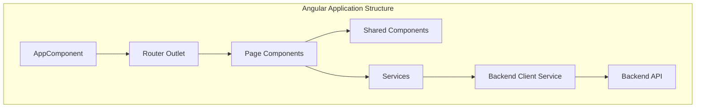
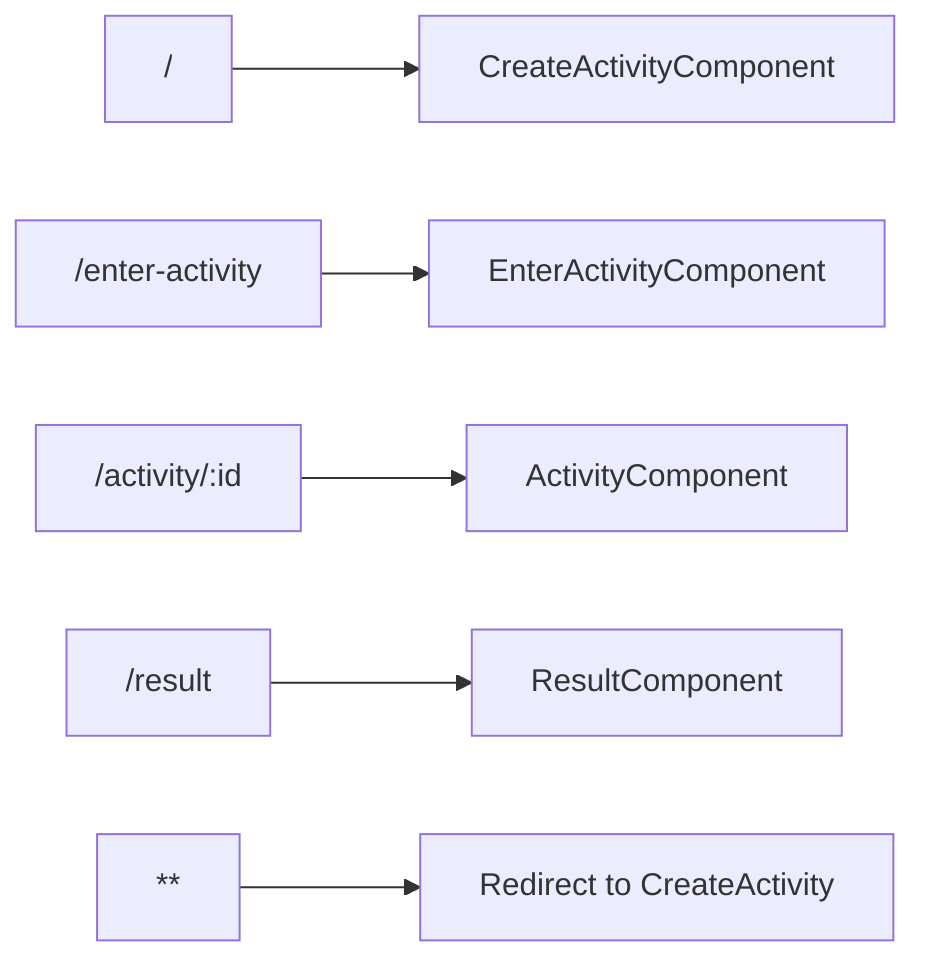
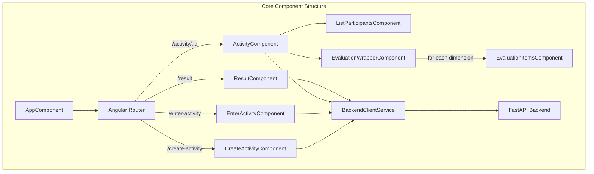
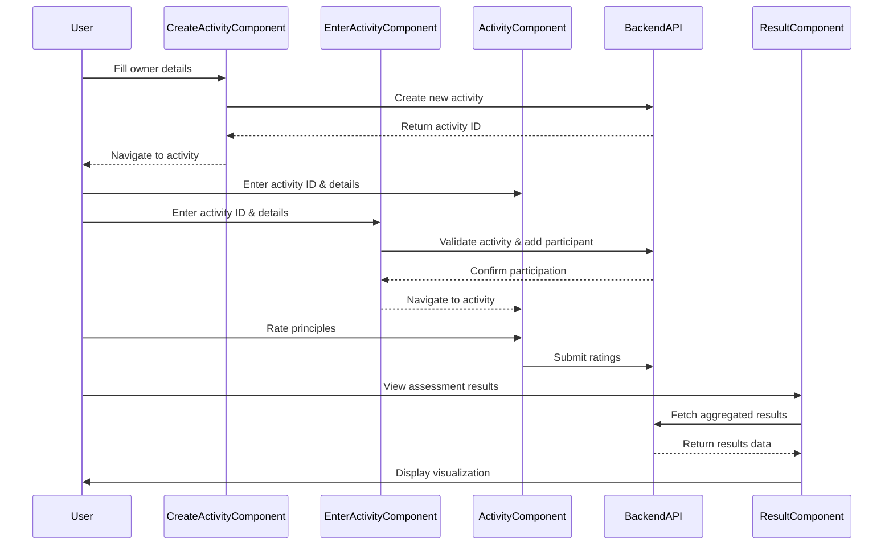
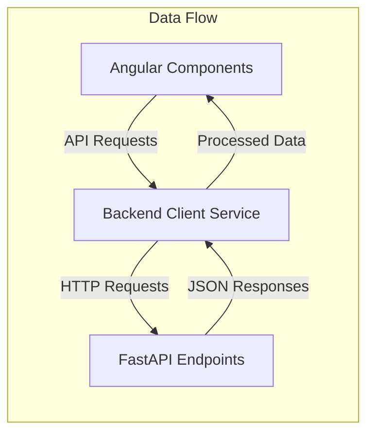
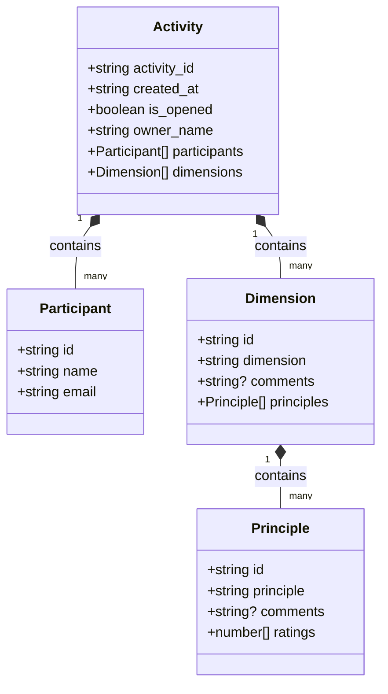
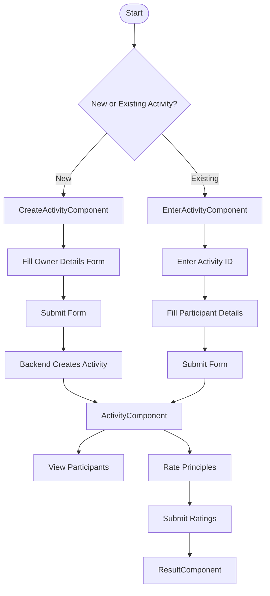

# Front End

Essa seção fornece uma visão geral técnica da aplicação front-end do sistema Agile Wheel. Ele aborda a arquitetura da aplicação de página única baseada em Angular, os principais componentes, a estrutura de roteamento e a interação com a API de back-end. Para obter informações sobre a implementação da API de back-end, consulte [API de back-end](../2-backend/index.md).

## Technology Stack and Architecture

O frontend do Agile Wheel é construído usando as seguintes tecnologias:

| Technology       | Version | Purpose                      |
|------------------|---------|------------------------------|
| Angular          | 19.2.x  | Core framework               |
| Angular Material | 19.2.x  | UI component library         |
| TailwindCSS      | 3.4.x   | Utility-first CSS framework  |
| RxJS             | 7.8.x   | Reactive programming library |
| ECharts          | 5.6.x   | Data visualization library   |

### Estrutura do aplicativo Angular

O aplicativo segue uma arquitetura padrão baseada em componentes Angular com a seguinte estrutura de alto nível:

## Routing System

O aplicativo utiliza o roteador do Angular para navegar entre diferentes páginas. A configuração de roteamento define os caminhos e seus componentes correspondentes.

A configuração da rota mapeia URLs para componentes específicos:

| Path             | Component                      | Description                        |
|------------------|--------------------------------|------------------------------------|
| /                | Redirects to 'create-activity' | Default route                      |
| /create-activity | CreateActivityComponent        | New activity creation screen       |
| /enter-activity  | EnterActivityComponent         | Join existing activity screen      |
| /activity/:id    | ActivityComponent              | Main activity page with evaluation |
| /result          | ResultComponent                | Results visualization              |
| **               | Redirects to 'create-activity' | Fallback for unknown routes        |

## Core Components

A funcionalidade do aplicativo é dividida em vários componentes principais, cada um lidando com responsabilidades específicas dentro do fluxo do aplicativo.

### Page Components

O aplicativo consiste em quatro componentes de página principais que representam diferentes estágios no processo de avaliação do Agile Wheel:

1. **CreateActivityComponent**: lida com a criação de novas atividades de avaliação, coletando informações do proprietário e inicializando a atividade no backend.

2. **EnterActivityComponent**: permite que os participantes participem de uma atividade existente inserindo o ID da atividade e os detalhes do participante.

3. **ActivityComponent**: O núcleo do aplicativo onde os participantes avaliam diferentes princípios ágeis em diversas dimensões. Contém componentes filhos para exibir os participantes e a interface de avaliação.

4. **ResultComponent**: visualiza os resultados das avaliações da atividade, provavelmente usando ECharts para representação gráfica.

### Interação de componentes

## Services and Data Flow

O aplicativo front-end se comunica com a API de back-end por meio de serviços que encapsulam as solicitações HTTP e manipulam o processamento de respostas.

### Backend Client Service

O Backend Client Service atua como o ponto central para todas as comunicações da API, fornecendo métodos para:

- Criando novas atividades
- Validando atividades
- Adicionando participantes
- Enviando avaliações
- Recuperando resultados

### Data Models

O frontend espelha os modelos de domínio do backend para garantir a digitação adequada dos dados:

## UI Components and Styling

### Angular Material Integration

O aplicativo usa Angular Material para componentes de interface de usuário consistentes, proporcionando uma aparência moderna e garantindo usabilidade em todos os dispositivos.

Os principais componentes do material utilizado incluem:

- Form controls (inputs, buttons, selectors)
- Dialog boxes
- Cards
- Progress indicators
- Navigation elements

### TailwindCSS Styling

O TailwindCSS é usado para estilização focada em utilidade, permitindo desenvolvimento rápido de interfaces de usuário e padrões de design consistentes. Isso é combinado com o sistema de temas do Angular Material.

### Responsive Design

A interface do usuário do aplicativo foi projetada para ser responsiva, adaptando-se a diferentes tamanhos de tela, de desktops a dispositivos móveis, implementada por meio do sistema de grade responsiva do Angular Material e dos utilitários responsivos TailwindCSS.

## User Flow

O fluxo típico do usuário pelo aplicativo segue este caminho:

## Build and Deployment

O aplicativo Angular é criado e servido usando a CLI Angular. O desenvolvimento é facilitado por contêineres Docker com recarregamento dinâmico habilitado.

### Development Environment

Para desenvolvimento local, o aplicativo é executado em um contêiner Node.js exposto na porta 4444, com recarregamento dinâmico habilitado para ciclos de desenvolvimento mais rápidos.

### Production Build

Para produção, o aplicativo é compilado usando a compilação ahead-of-time (AOT) do Angular para desempenho ideal e servido por meio de um contêiner Nginx.

## Conclusão

O aplicativo frontend Agile Wheel oferece uma interface intuitiva para criar, participar e avaliar avaliações de práticas ágeis. Sua arquitetura baseada em componentes, fluxo de dados reativo e estrutura de interface de usuário moderna se combinam para proporcionar uma experiência responsiva e amigável.

O design modular do aplicativo permite fácil manutenção e extensões futuras, enquanto a integração com a API de backend garante consistência de dados e atualizações em tempo real durante as sessões de avaliação.

