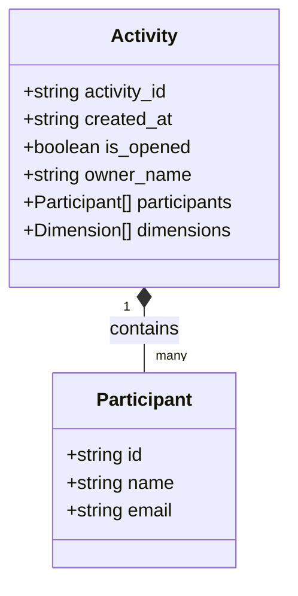
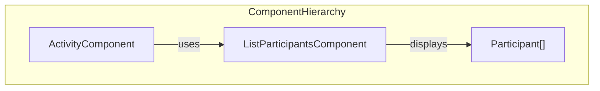
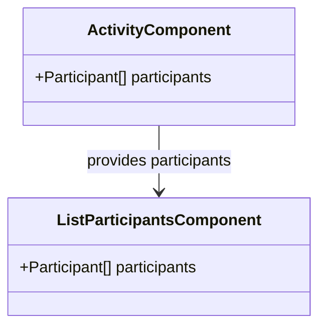
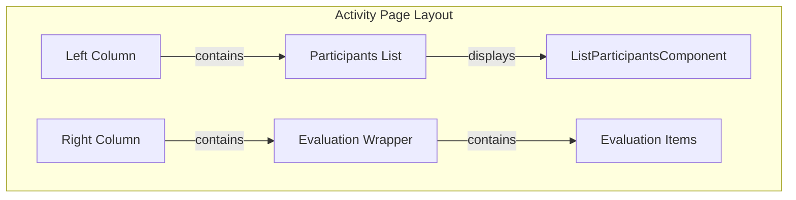
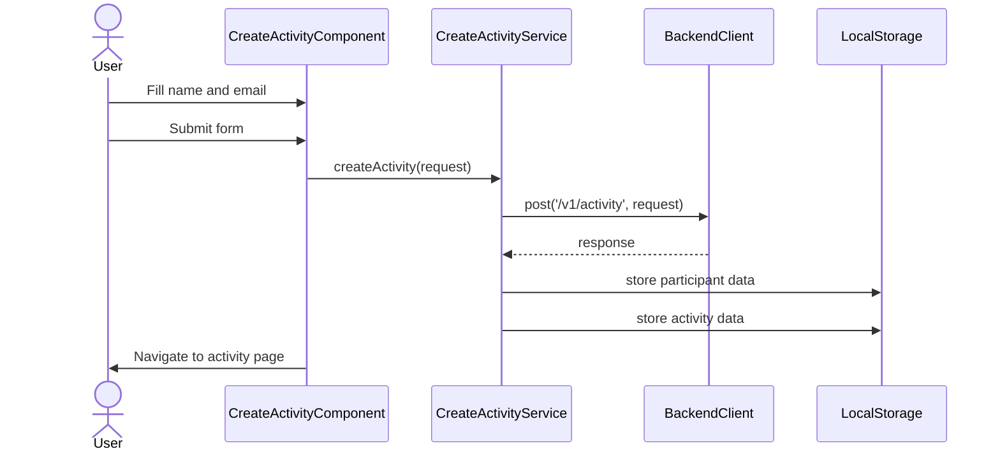
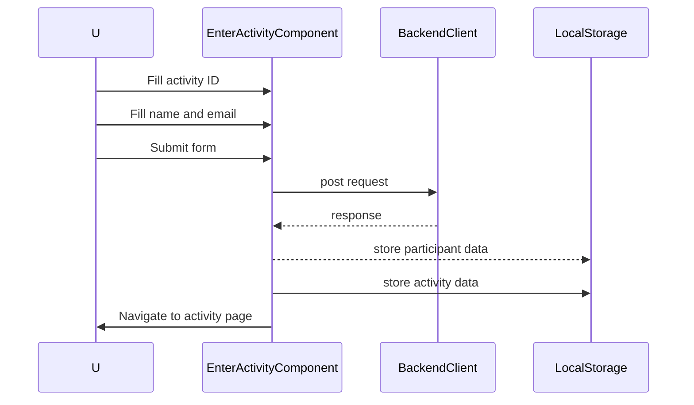
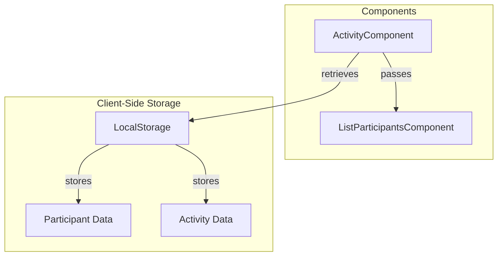
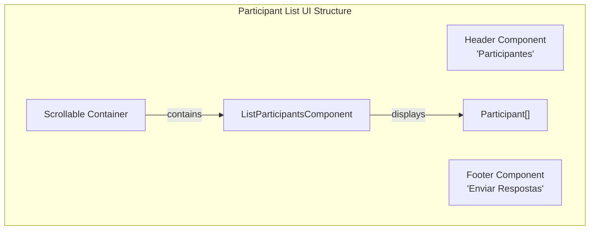
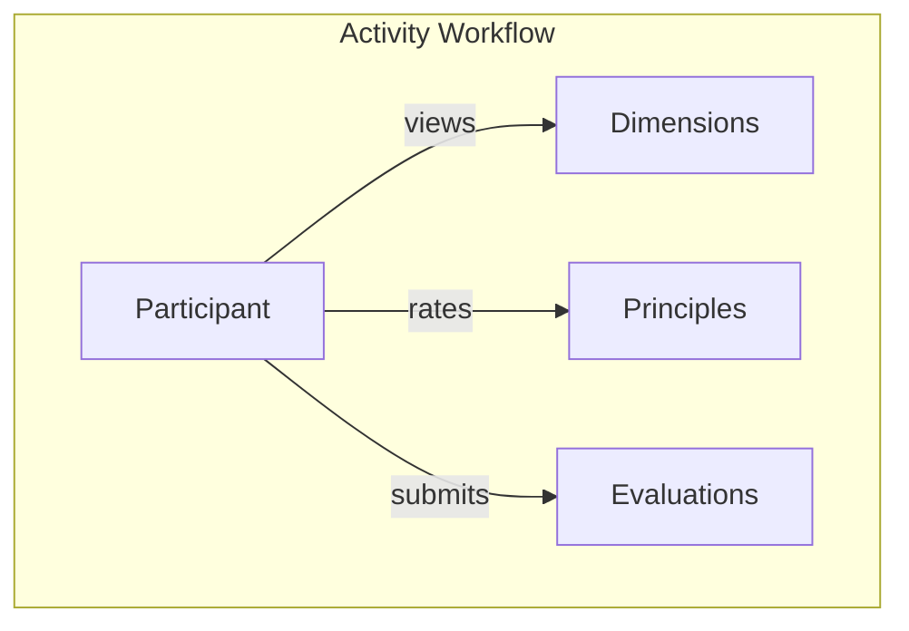

# Participants

## Objetivo e escopo

Essa seção detalha a funcionalidade de participantes no aplicativo Agile Wheel. Ele aborda como os participantes são exibidos, gerenciados e integrados ao fluxo de trabalho da atividade. Participantes são usuários que ingressam em uma atividade para avaliar os princípios ágeis em diferentes dimensões.

Para obter informações sobre o processo de criação de atividades, consulte [Criação e Inscrição de Atividades](activity-creation-entry.md). Para obter detalhes sobre como os participantes interagem com as avaliações, consulte [Componentes de Avaliação](component-evaluation.md).

## Modelo de Dados do Participante

A entidade participante é um componente central do aplicativo Agile Wheel. Cada atividade contém uma lista de participantes que podem fornecer avaliações.



A interface ```Participant``` consiste em três propriedades principais:

- `id`: Identificador único para o participante
- `name`: Nome de exibição do participante
- `email`: Endereço de e-mail do participante

## Componente - Lista de Participantes

O componente de lista de participantes (`ListParticipantsComponent`) é responsável por exibir todos os participantes de uma atividade. É um componente Angular independente que renderiza uma lista de participantes na barra lateral esquerda da página da atividade.



### Estrutura do componente

O componente recebe uma lista de participantes como uma propriedade de entrada e os renderiza na interface do usuário. Ele usa componentes do Angular Material para estilização e layout.



### Integração no Layout de Atividades

O `ListParticipantsComponent` está posicionado na coluna esquerda da página de atividades, fornecendo uma visão persistente de todos os participantes durante todo o processo de avaliação.



## Particiando de uma Atividade

Há duas maneiras principais de adicionar participantes a uma atividade:

1. **Como criador de atividade**: quando um usuário cria uma nova atividade, ele se torna o primeiro participante (proprietário)
2. **Ao ingressar em uma atividade existente**: os usuários podem ingressar em atividades existentes fornecendo o ID da atividade e seus dados pessoais

### Fluxo de Criação de Atividades

Ao criar uma atividade, o usuário preenche um formulário com seu nome e e-mail. Após o envio, ele é registrado como o primeiro participante (proprietário) da atividade.



### Fluxo de Entrada em Atividades

Os usuários podem participar de uma atividade existente fornecendo o ID da atividade, seu nome e endereço de e-mail por meio do formulário de inscrição de atividade.



## Gestão de Dados dos Participantes

### Armazenamento de dados

Os dados dos participantes são armazenados temporariamente no armazenamento local do navegador durante toda a sessão. Isso permite que o aplicativo mantenha a identidade do participante em todas as atualizações de página sem exigir autenticação.



### Exibição do participante

A lista de participantes é exibida em um contêiner rolável na barra lateral esquerda da página de atividades. Isso permite fácil visibilidade de todos os participantes, mesmo que o número deles aumente.



## Integração com o Processo de Avaliação

Os participantes são essenciais para o processo de avaliação no aplicativo Roda Ágil. Cada participante pode enviar suas avaliações para os princípios de cada dimensão.



O botão "Enviar Respostas" na seção de lista de participantes permite que eles finalizem suas avaliações e naveguem até a página de resultados.

## Resumo

O sistema de gerenciamento de participantes no Agile Wheel oferece uma maneira simples de:

1. Adicione participantes por meio da criação de atividades e ingresse em fluxos
2. Exibir uma lista de participantes na interface de atividade
3. Associar os participantes às suas avaliações
4. Habilitar o envio de avaliações

Este componente é essencial para a natureza colaborativa da estrutura de avaliação do Agile Wheel, permitindo que vários membros da equipe participem do processo de avaliação simultaneamente.
