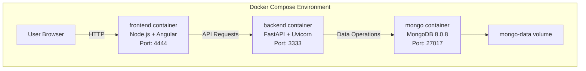
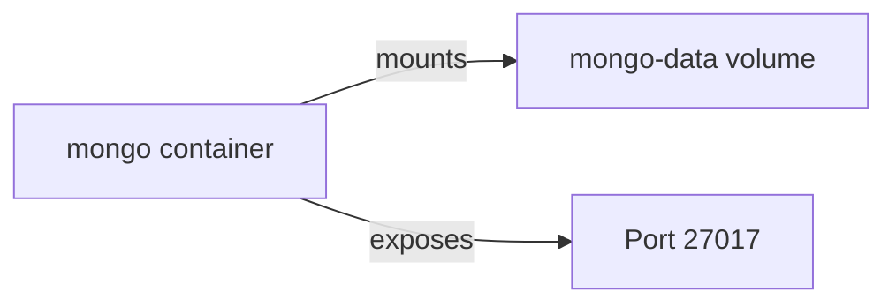
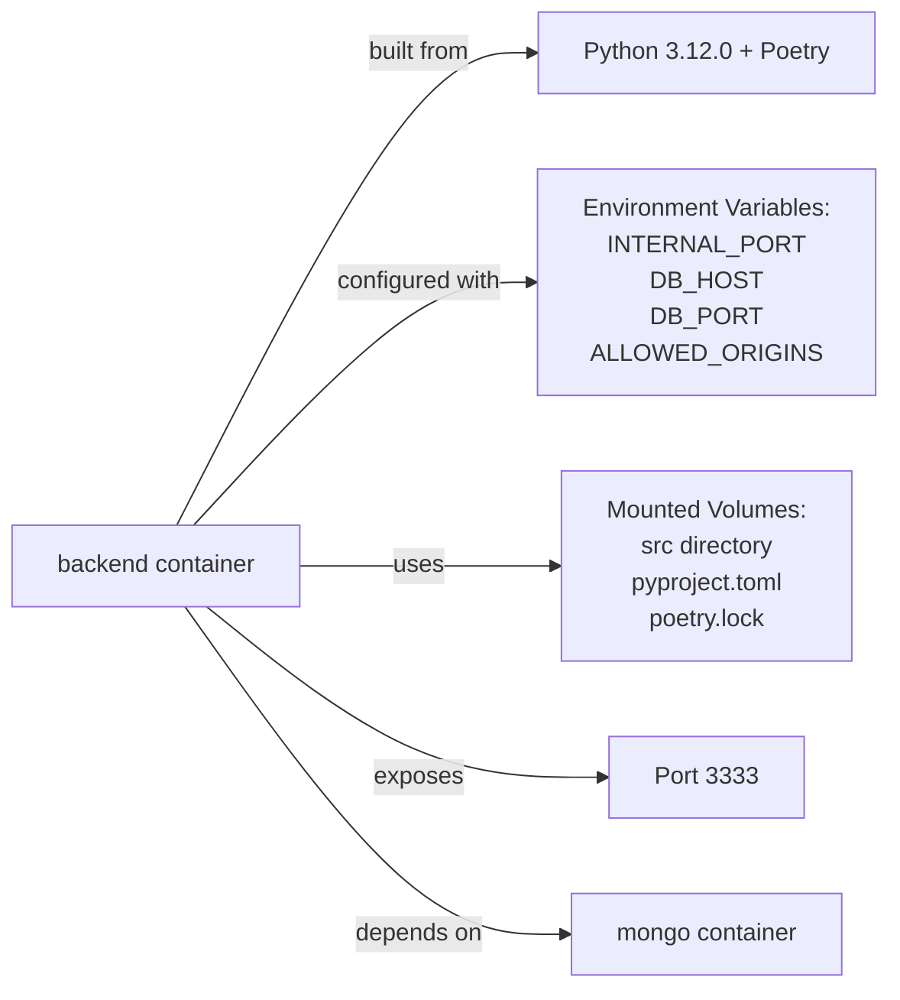
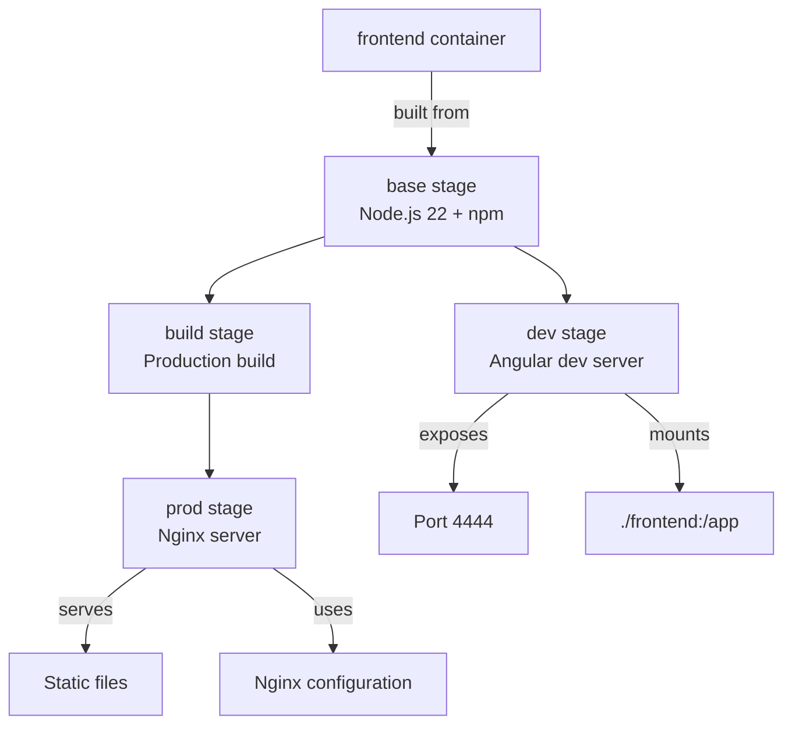
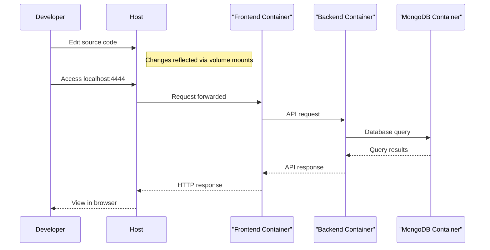

# Docker Setup

Esta página documenta a configuração do Docker no projeto Agile Wheel, abrangendo a configuração de conteinerização para o banco de dados MongoDB, o backend Python FastAPI e os componentes do frontend Angular, juntamente com suas redes, montagens de volume e configurações de ambiente.

Para obter informações sobre integração contínua, consulte [Integração contínua](continuous-integration.md).

## 1. Visão geral da arquitetura

O aplicativo Agile Wheel usa uma arquitetura de três camadas em contêiner orquestrada pelo Docker Compose:



Essa arquitetura oferece diversas vantagens:

- Ambientes isolados para cada componente
- Desenvolvimento consistente e implantações de produção
- Descoberta de serviço simples usando nomes de contêineres
- Configuração fácil através de variáveis ​​de ambiente

## 2. Especificações do contêiner

### Contêiner MongoDB

O contêiner MongoDB usa a imagem oficial do MongoDB 8.0.8 com a seguinte configuração:



### Contêiner de backend

O contêiner de backend é criado a partir de um Dockerfile personalizado baseado no Python 3.12.0-slim:



O contêiner de backend usa Poetry para gerenciamento de dependências e monta o código-fonte como volumes para desenvolvimento com recarregamento dinâmico.

### Contêiner de front-end

O contêiner frontend usa um Dockerfile de vários estágios para dar suporte a cenários de desenvolvimento e produção:



Na configuração padrão do Docker Compose, o stage `dev` é usado para facilitar o desenvolvimento com:

- Atualizações de código-fonte em tempo real por meio de montagens de volume
- Servidor de desenvolvimento angular com substituição de módulo a quente
- Porta 4444 exposta ao host

## 3. Environment Configuration

O aplicativo usa variáveis ​​de ambiente para configuração com padrões e recursos de substituição:

| Variable               | Default       | Description                              |
|------------------------|---------------|------------------------------------------|
| INTERNAL_BACKEND_PORT  | 8000          | Internal port for the backend container  |
| INTERNAL_FRONTEND_PORT | 80            | Internal port for the frontend container |
| DB_HOST                | mongo         | MongoDB hostname (container name)        |
| DB_PORT                | 27017         | MongoDB port                             |
| ALLOWED_ORIGINS        | Multiple URLs | CORS allowed origins for the backend     |

Essas variáveis ​​podem ser personalizadas criando um arquivo `.env` com base no modelo fornecido.

## 4. Configuração do Docker Compose

O `docker-compose.yaml` arquivo define todos os três serviços, suas dependências e configuração:

### Definição de serviço do MongoDB

```yml
mongo:
  image: mongo:8.0.8
  ports:
    - "27017:27017"
  volumes:
    - mongo-data:/data/db
```

### Definição de serviço de backend

```yml
backend:
  build:
    context: ./backend
    dockerfile: Dockerfile
  environment:
    - INTERNAL_PORT=${INTERNAL_BACKEND_PORT:-8000}
    - DB_HOST=mongo
    - DB_PORT=27017
    - ALLOWED_ORIGINS=http://localhost:4200,http://127.0.0.1:4200,http://localhost:4444,http://127.0.0.1:4444
  ports:
    - "3333:${INTERNAL_BACKEND_PORT:-8000}"
  depends_on:
    - mongo
  volumes:
    - ./backend/src:/app/src
    - ./backend/pyproject.toml:/app/pyproject.toml
    - ./backend/poetry.lock:/app/poetry.lock
  command: uvicorn src.main:app --host 0.0.0.0 --port ${INTERNAL_BACKEND_PORT:-8000} --reload
```

Definição de Serviço Frontend

```yml
frontend:
  build:
    context: ./frontend
    dockerfile: Dockerfile
    target: dev
  environment:
    - INTERNAL_PORT=${INTERNAL_FRONTEND_PORT:-80}
  ports:
    - "4444:${INTERNAL_FRONTEND_PORT:-80}"
  depends_on:
    - backend
  volumes:
    - ./frontend:/app
    - /app/node_modules
  command: npm run start -- --port=${INTERNAL_FRONTEND_PORT:-80} --host=0.0.0.0
```

## 5. Development Workflow

A configuração do Docker Compose otimiza o fluxo de trabalho de desenvolvimento por meio de:



Principais recursos para desenvolvimento:

1. Montagens de volume para código-fonte que permitem recarregamento dinâmico
2. Comandos do servidor de desenvolvimento para backend ( uvicorncom --reload) e frontend
3. Mapeamentos de portas para acessar serviços da máquina host
4. Tratamento de dependências entre serviços

## 6. Configuração de produção

Para implantação de produção, o Dockerfile do frontend fornece um estágio de produção dedicado:

1. O estágio `build` cria uma construção Angular otimizada para produção com:

```
RUN npm run build --prod
```

2. O estágio `prod` configura o Nginx para servir os arquivos estáticos:

```
FROM nginx:alpine AS prod
COPY --from=build /app/dist/front/browser /usr/share/nginx/html
COPY nginx.conf.template /etc/nginx/nginx.conf.template
ENV INTERNAL_PORT=80
EXPOSE ${INTERNAL_PORT}
RUN envsubst '${INTERNAL_PORT}' < /etc/nginx/nginx.conf.template > /etc/nginx/nginx.conf
CMD ["nginx", "-g", "daemon off;"]
```

Para usar a configuração de produção, modifique o arquivo `docker-compose.yaml` para usar o proddestino para o frontend:

```
frontend:
  build:
    context: ./frontend
    dockerfile: Dockerfile
    target: prod  # Change from 'dev' to 'prod' 
```

## 7. Comandos de uso

Comandos comuns do Docker Compose para trabalhar com o aplicativo Agile Wheel:

| Command                          | Description                         |
|----------------------------------|-------------------------------------|
| docker-compose up                | Start all services in foreground    |
| docker-compose up -d             | Start all services in detached mode |
| docker-compose up --build        | Rebuild containers and start        |
| docker-compose down              | Stop all services                   |
| docker-compose logs -f           | View logs in follow mode            |
| docker-compose ps                | List running containers             |
| docker-compose exec backend bash | Execute bash in backend container   |
| docker-compose exec frontend sh  | Execute shell in frontend container |

## 8. Persistência de dados

Os dados do MongoDB são persistidos usando um volume Docker nomeado:

```
volumes:
  mongo-data:
```

Isso garante que os dados do banco de dados sobrevivam a reinicializações e remoções de contêineres. O volume é criado automaticamente pelo Docker Compose se não existir.