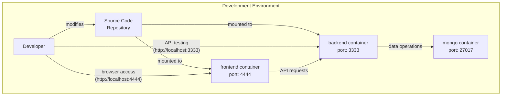
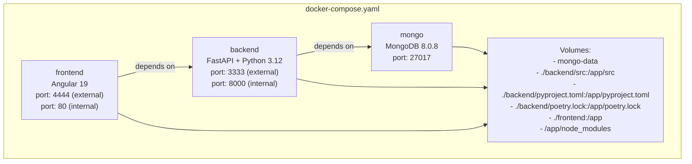
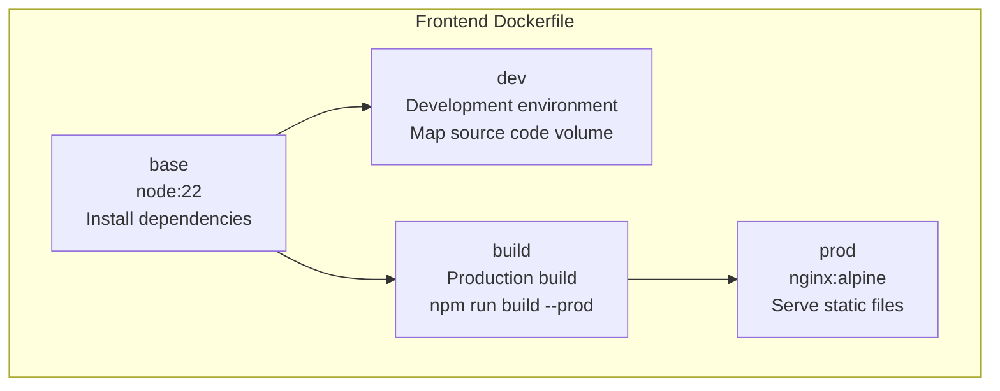
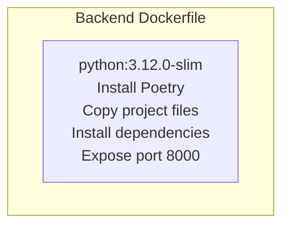
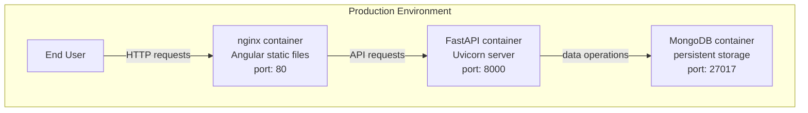
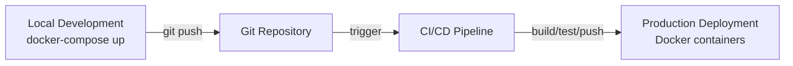

# Development and Deployment

This document covers the development workflows, environment setup, and deployment process for the Agile Wheel application. It provides detailed information on the Docker configuration, development tools, and deployment strategies used in the project. For information about Docker setup details, see [Docker Setup](docker-setup.md). For information about Continuous Integration, see [Continuous Integration](continuous-integration.md).

## 1. Visão geral do ambiente de desenvolvimento

O projeto Agile Wheel utiliza um ambiente de desenvolvimento em contêineres para garantir a consistência entre diferentes máquinas de desenvolvimento. O ambiente consiste em três serviços principais:

- **`MongoDB`** - Banco de dados para armazenamento de dados de atividades
- **`Backend`** - Aplicação FastAPI escrita em Python
- **`Frontend`** - Aplicação Angular atendida durante o desenvolvimento

### Arquitetura de Desenvolvimento



## 2. Configurando o ambiente de desenvolvimento

### Pré-requisitos

Antes de configurar o ambiente de desenvolvimento, certifique-se de ter as seguintes ferramentas instaladas:

- Docker e Docker Compose
- Git

### Etapas de instalação

1. Clone o repositório:

```sh
git clone https://github.com/miguelsmuller/agile-wheel
cd agile-wheel
```

2. Inicie o ambiente de desenvolvimento:

```sh
docker-compose up
```

3. Acesse os aplicativos:

- Front-end: http://localhost:4444
- API de back-end: http://localhost:3333
- MongoDB: localhost:27017

## 3. Configuração do Docker

O projeto usa o Docker Compose para orquestrar o ambiente de desenvolvimento, com Dockerfiles separados para serviços de front-end e back-end.

### Configuração do Docker Compose

O arquivo  `docker-compose.yaml` define três serviços:



### Variáveis ​​de ambiente

| Variable               | Default                                                                                 | Description                            |
|------------------------|-----------------------------------------------------------------------------------------|----------------------------------------|
| INTERNAL_BACKEND_PORT  | 8000                                                                                    | Internal port for the backend service  |
| INTERNAL_FRONTEND_PORT | 80                                                                                      | Internal port for the frontend service |
| DB_HOST                | mongo                                                                                   | MongoDB host name                      |
| DB_PORT                | 27017                                                                                   | MongoDB port                           |
| ALLOWED_ORIGINS        | http://localhost:4200,htt... | CORS allowed origins                   |

### Configuração do Docker do Frontend

O Dockerfile do frontend usa um processo de construção de vários estágios para otimizar os ambientes de desenvolvimento e produção:



### Configuração do Docker de backend

O Dockerfile de backend configura um ambiente Python com Poetry para gerenciamento de dependências:



## 4. Development Workflow

### Desenvolvimento Frontend

O frontend Angular usa comandos Angular CLI padrão para desenvolvimento, que são executados dentro do contêiner Docker:

| Script          | Purpose                      |
|-----------------|------------------------------|
| `npm run start` | Start the development server |
| `npm run build` | Build the application        |
| `npm run watch` | Build and watch for changes  |
| `npm run test`  | Run tests                    |

O frontend foi criado com Angular 19 e usa diversas dependências, incluindo Angular Material e TailwindCSS para estilização.

### Desenvolvimento de Backend

O backend usa Poetry para gerenciamento de dependências e executa FastAPI com Uvicorn. As principais dependências incluem:

- FastAPI (v0.115.x) - Estrutura da Web
- Uvicorn - servidor ASGI
- Beanie (v1.29.x) - MongoDB ODM
- Motor (v3.7.x) - driver assíncrono MongoDB
- Pydantic - Validação de dados

O backend usa uma abordagem de recarregamento dinâmico durante o desenvolvimento, com alterações no código-fonte recarregadas automaticamente.

## 5. Development Tools

### Backend Development Tools

O backend usa várias ferramentas de desenvolvimento configuradas em pyproject.toml:

| Tool       | Purpose                     |
|------------|-----------------------------|
| pytest     | Testing framework           |
| ruff       | Linting and code formatting |
| mypy       | Static type checking        |
| pytest-cov | Test coverage               |
| pdbpp      | Enhanced Python debugger    |

Poe the Poet é usado para execução de tarefas:

```sh
poetry run poe serve  # Run the development server
poetry run poe ruff   # Run the linter with auto-fixing
```

## 6. Deployment Process

### Production Deployment Architecture

O aplicativo Agile Wheel foi projetado para ser implantado usando contêineres Docker em um ambiente de produção.



### Construção de produção de front-end

Para implantação de produção, o Dockerfile frontend cria uma versão otimizada para produção do aplicativo Angular e a atende usando o Nginx:

1. O estágio de construção compila o aplicativo Angular usando `npm run build --prod`
2. O estágio de produção copia os ativos compilados para o Nginx e configura o servidor

### Implantação de produção de backend

O Dockerfile de backend é configurado para implantação de produção por padrão, usando Poetry para gerenciar dependências e Uvicorn para atender ao aplicativo FastAPI.

## 7. Development-to-Production Workflow

O projeto segue um fluxo de trabalho simplificado do desenvolvimento à produção:



### Build Process Comparison

| Environment | Frontend                           | Backend                    |
|-------------|------------------------------------|----------------------------|
| Development | Angular dev server with hot-reload | Uvicorn with --reload flag |
| Production  | Static files served by Nginx       | Uvicorn without reload     |


## 8. Conclusão

O projeto Agile Wheel emprega uma abordagem moderna de desenvolvimento e implantação em contêineres usando o Docker. Isso garante consistência entre os ambientes e simplifica o fluxo de trabalho do desenvolvimento à produção. A configuração permite tanto o desenvolvimento rápido com recarregamento dinâmico quanto implantações otimizadas em produção.