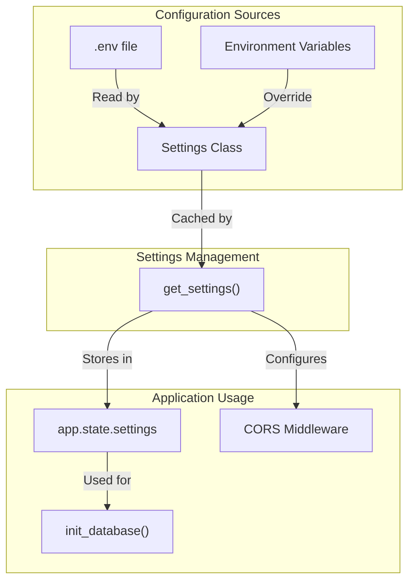
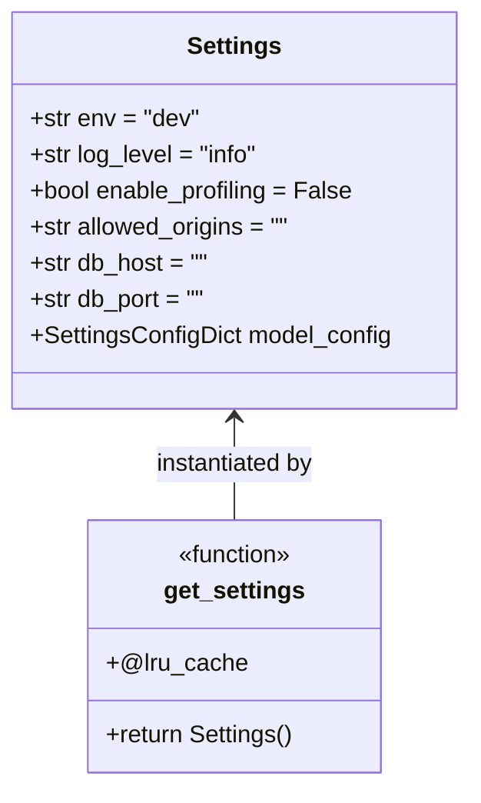
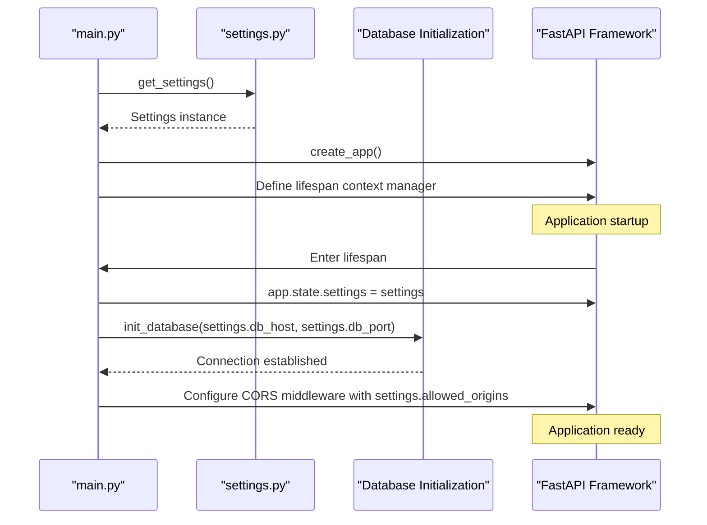
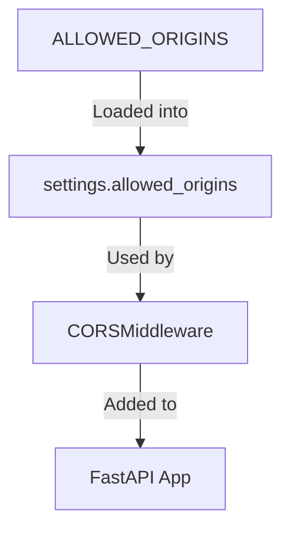
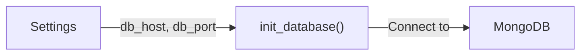
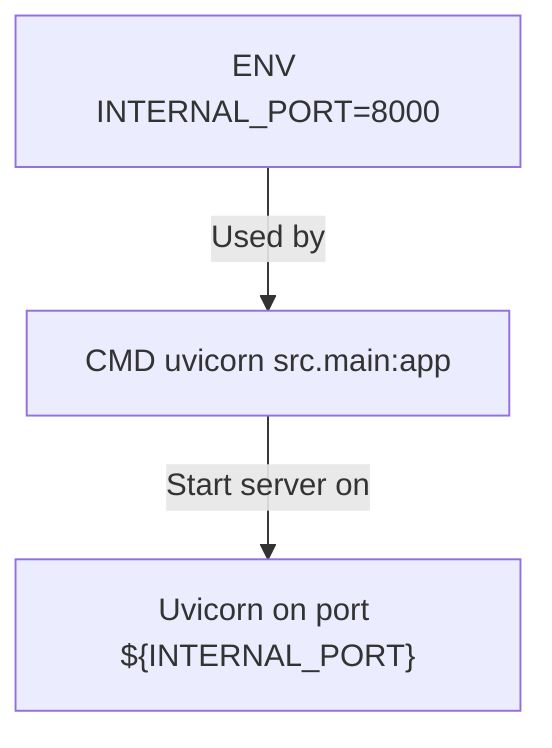

# Configuração de backend

Ess seção detalha o sistema de configuração do backend do Agile Wheel. Ele aborda as variáveis ​​de ambiente, seu gerenciamento por meio das configurações do Pydantic e como elas são utilizadas em toda a aplicação. Para obter informações sobre endpoints de API, consulte [Contexto - Activity](context-activity.md).

## Configuration System Overview

O backend do Agile Wheel utiliza o gerenciamento de configurações do Pydantic para carregar, validar e acessar parâmetros de configuração. Os valores de configuração são obtidos de variáveis ​​de ambiente ou de um `.env` arquivo, com padrões fornecidos quando necessário.



## Settings Model

O backend usa uma `Settings` classe Pydantic para definir, validar e acessar valores de configuração:



A classe `Settings` herda do Pydantic `BaseSettings`, que carrega automaticamente valores de variáveis ​​de ambiente. O atributo `model_config` configura o comportamento das configurações, incluindo o `.env` local do arquivo.

A `get_settings()` função é decorada `@lru_cache` para garantir que as configurações sejam carregadas apenas uma vez e reutilizadas eficientemente em todo o aplicativo.

## Environment Variables

As seguintes variáveis ​​de ambiente podem ser configuradas:


| Variable           | Default | Description                              |
|--------------------|---------|------------------------------------------|
| `ENV`              | "dev"   | Environment mode (dev/test/prod)         |
| `LOG_LEVEL`        | "info"  | Logging level (debug/info/warning/error) |
| `ENABLE_PROFILING` | false   | Enable performance profiling             |
| `ALLOWED_ORIGINS`  | ""      | Comma-separated list of CORS origins     |
| `DB_HOST`          | ""      | MongoDB host address                     |
| `DB_PORT`          | ""      | MongoDB port number                      |
| `INTERNAL_PORT`    | 8000    | FastAPI server port (Docker only)        |

Um modelo para o `.env` arquivo é fornecido no repositório:

```
ENV=test
DB_HOST=localhost
DB_PORT=27017
ENABLE_PROFILING=true
LOG_LEVEL=debug
ALLOWED_ORIGINS=*
```

##  Settings Usage in Application Lifecycle

As configurações são integradas ao aplicativo FastAPI por meio do seguinte processo:



Fluxo de configuração do aplicativo:

1. As configurações são carregadas via `get_settings()`
2. O gerenciador de contexto `lifespan`:
    - Armazena configurações no estado do aplicativo
    - Inicializa a conexão do banco de dados usando as configurações
3. O middleware CORS é configurado com origens permitidas

## Configuração CORS

O Compartilhamento de Recursos entre Origens (CORS) é configurado por meio da variável de ambiente `ALLOWED_ORIGINS`:



O middleware CORS usa `settings.allowed_origins` para controlar quais domínios podem acessar a API:

- `ALLOWED_ORIGINS= *` permite qualquer origem (desenvolvimento)
- `ALLOWED_ORIGINS=https://domain.com` restringe-se a origens específicas (produção)

## Configuração do banco de dados

Os parâmetros de conexão do banco de dados são especificados por meio de:

- `DB_HOST`: Endereço do host MongoDB
- `DB_PORT`: Número da porta do MongoDB

Essas configurações são usadas durante a inicialização do aplicativo para inicializar a conexão com o banco de dados:



A inicialização do banco de dados ocorre durante a inicialização do aplicativo FastAPI no gerenciador de contexto `lifespan`.

## Configuração do Docker

A configuração do Docker define a porta padrão para o servidor FastAPI:



A `INTERNAL_PORT` variável de ambiente (padrão: 8000) é usada para configurar a porta na qual o Uvicorn atende o aplicativo FastAPI.

## Dependências

O sistema de configuração depende das seguintes dependências principais:

| Dependency        | Version             | Purpose                                      |
|-------------------|---------------------|----------------------------------------------|
| pydantic-settings | >=2.8.1,<3.0.0      | Environment variable and settings management |
| python-dotenv     | >=1.1.0,<2.0.0      | Loading values from .env files               |
| fastapi           | >=0.115.12,<0.116.0 | Web framework with settings integration      |


## Configurações específicas do ambiente

Diferentes ambientes normalmente usam configurações diferentes:

| Setting            | Development | Production             |
|--------------------|-------------|------------------------|
| `ENV`              | "dev"       | "prod"                 |
| `LOG_LEVEL`        | "debug"     | "info" or "warning"    |
| `ENABLE_PROFILING` | true        | false                  |
| `ALLOWED_ORIGINS`  | "*"         | Specific domain list   |
| `DB_HOST`          | "localhost" | Production DB hostname |
| `DB_PORT`          | "27017"     | Production DB port     |
