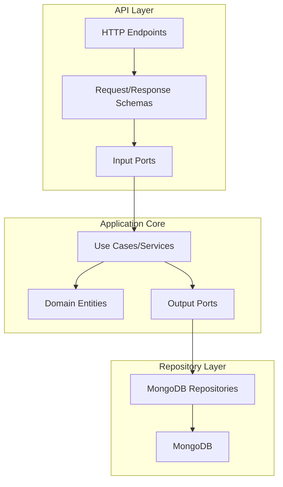
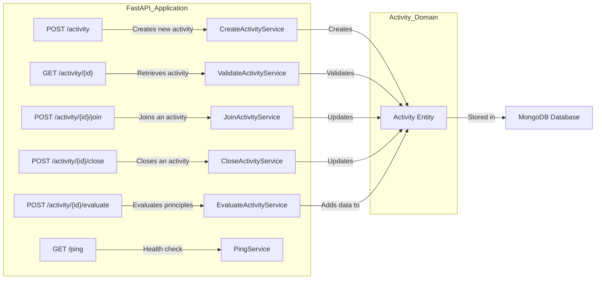
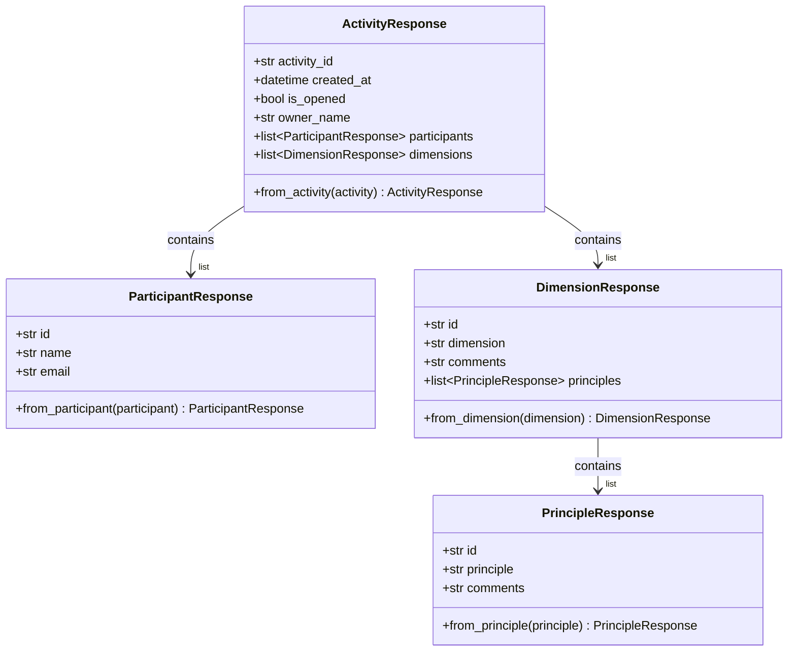
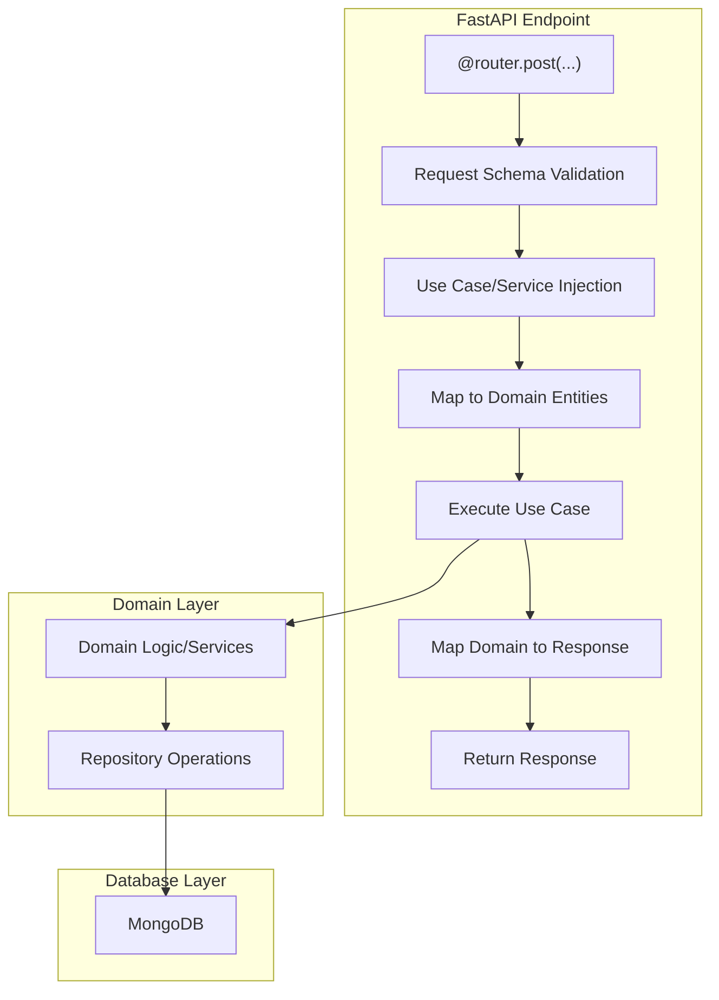
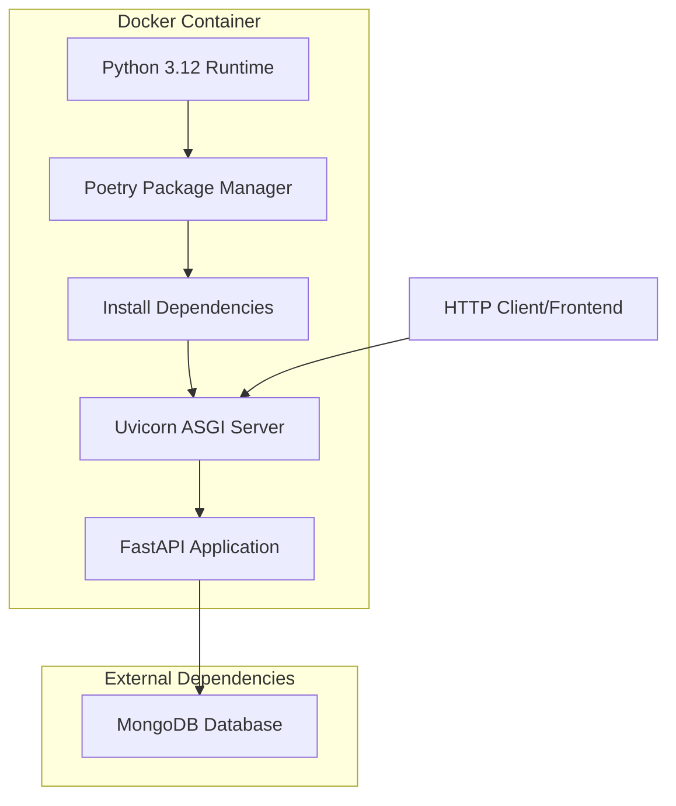

# Backend

Este documento fornece uma visão geral do componente backend para o aplicativo Agile Wheel. A API serve atualmente como ponto de integração entre a camada de apresentação e a camada de persistência, gerenciando todas as operações de dados por meio de uma interface RESTful desenvolvida com Python/FastAPI.

Para obter informações sobre a arquitetura geral do backend e os princípios de design, consulte [Arquitetura do backend](../1-architecture/index.md).

## Visão geral da API

A API de backend do Agile Wheel segue uma arquitetura hexagonal (padrão de portas e adaptadores) para manter a separação de interesses entre a lógica de domínio e as interfaces externas. A camada de API atua como um adaptador de entrada que transforma solicitações HTTP em operações de domínio.



## Pontos de extremidade da API

O backend fornece vários endpoints RESTful para o aplicativo Agile Wheel:



### Tabela de resumo de endpoints

| Endpoint                  | Method | Description                                 | Request Schema          | Response Schema          |
|---------------------------|--------|---------------------------------------------|-------------------------|--------------------------|
| `/activity`               | POST   | Creates a new Agile Wheel activity          | `CreateActivityRequest` | `CreateActivityResponse` |
| `/activity/{id}`          | GET    | Retrieves an existing activity              | -                       | `StatusResponse`         |
| `/activity/{id}/join`     | POST   | Joins an existing activity as a participant | `JoinRequest`           | `JoinResponse`           |
| `/activity/{id}/close`    | POST   | Closes an activity for further evaluations  | -                       | `CloseResponse`          |
| `/activity/{id}/evaluate` | POST   | Submits evaluations for principles          | `EvaluationRequest`     | `EvaluationResponse`     |
| `/ping`                   | GET    | Health check endpoint                       | -                       | `PongResponse`           |


## Request and Response Schemas

A API utiliza modelos Pydantic para validação e serialização de dados de solicitação/resposta. Esses esquemas funcionam como um contrato entre o front-end e o back-end.

### Core Response Models

Esses modelos representam as entidades de domínio quando retornados em respostas de API:



### Request Schemas e Response Schemas

Os seguintes esquemas são usados ​​para solicitações de entrada:

??? "backend/src/adapters/input/schemas.py"

    ```python title="backend/src/adapters/input/http/schemas.py"
    --8<-- "./backend/src/adapters/input/http/schemas.py"
    ```

## API Implementation Pattern

A implementação da API segue um padrão consistente usando o sistema de injeção de dependência do FastAPI:



Exemplo de implementação da base de código:

??? "backend/src/adapters/input/router.py"

    ```python title="backend/src/adapters/input/router.py"
    --8<-- "./backend/src/adapters/input/router.py"
    ```

## API Dependencies and Configuration

A API de backend depende de diversas dependências definidas na configuração do projeto:

| Dependency        | Version                   | Purpose                              |
|-------------------|---------------------------|--------------------------------------|
| FastAPI           | &gt;=0.115.12,&lt;0.116.0 | Web framework for building APIs      |
| Uvicorn           | &gt;=0.34.0,&lt;0.35.0    | ASGI server for FastAPI              |
| Pydantic          | &gt;=2.11.2,&lt;3.0.0     | Data validation and serialization    |
| Beanie            | &gt;=1.29.0,&lt;2.0.0     | MongoDB ODM (Object Document Mapper) |
| Motor             | &gt;=3.7.0,&lt;4.0.0      | Async MongoDB driver                 |
| Pydantic-settings | &gt;=2.8.1,&lt;3.0.0      | Settings management with Pydantic    |


## API Deployment

A API é conteinerizada usando o Docker e pode ser implantada como parte da pilha completa do aplicativo:



O contêiner do Docker expõe a porta 8000 internamente, que pode ser mapeada para qualquer porta externa ao executar o contêiner.

Configuração de chaves no Dockerfile:

- Usa imagem slim do Python 3.12.0
- Instala dependências via Poetry
- Expõe porta interna configurável
- Executa o aplicativo usando Uvicorn

## API Error Handling

A API lida com erros por meio do sistema de exceções do FastAPI, retornando códigos de status HTTP apropriados:

| Error Condition       | HTTP Status               | Response                 |
|-----------------------|---------------------------|--------------------------|
| Invalid request data  | 422 Unprocessable Entity  | Validation error details |
| Activity not found    | 404 Not Found             | Error message            |
| Activity closed       | 400 Bad Request           | Error message            |
| Duplicate participant | 400 Bad Request           | Error message            |
| Server error          | 500 Internal Server Error | Error message            |

O FastAPI valida automaticamente os dados de solicitação usando os modelos Pydantic, reduzindo a necessidade de código de validação explícito nos endpoints.

