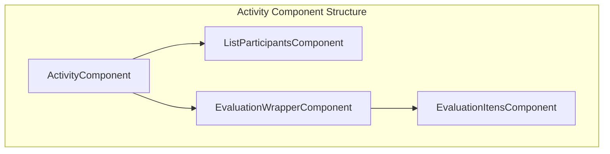
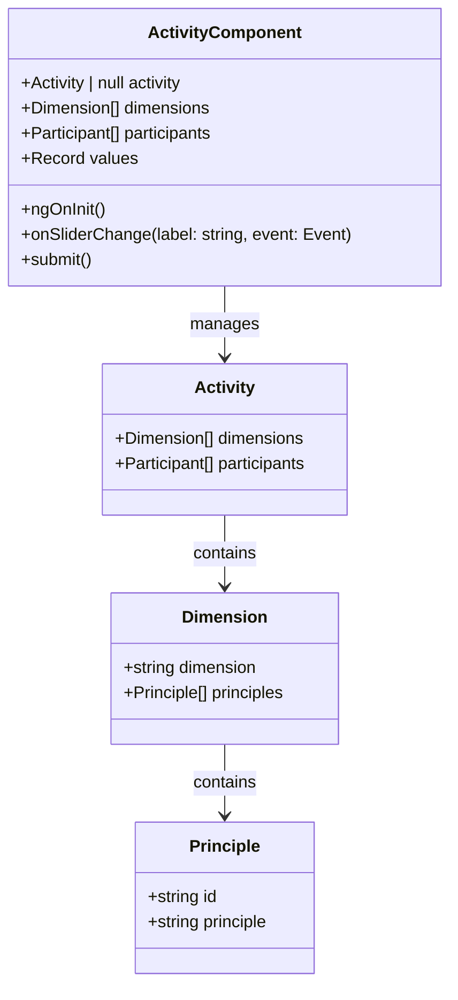
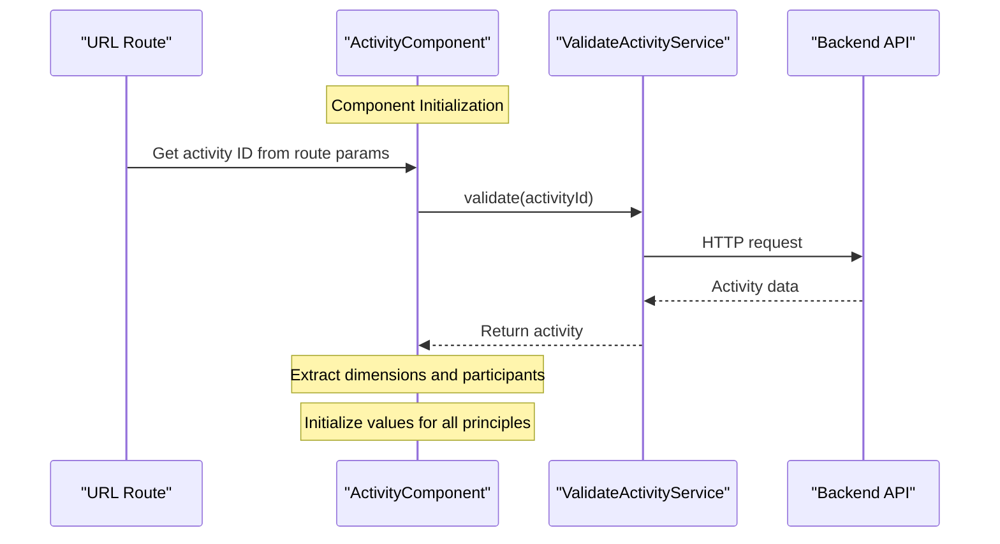
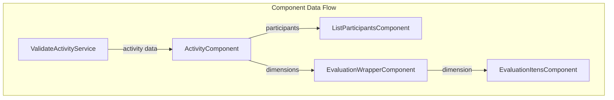
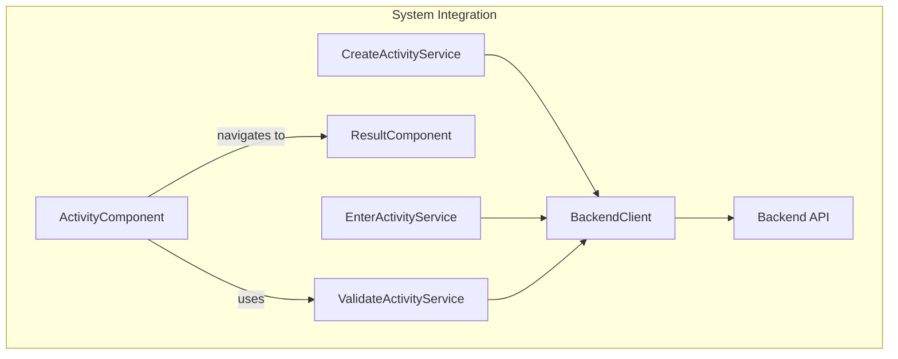

# Componente - Activity

## Objetivo e escopo

Este documento detalha os Componentes de Atividade no aplicativo Agile Wheel. Esses componentes formam os principais elementos interativos do aplicativo, onde os participantes avaliam práticas ágeis em diferentes dimensões e princípios. Esta página se concentra na estrutura, nos relacionamentos e na funcionalidade do componente Atividade e seus componentes filhos relacionados. Para obter informações sobre como criar novas atividades ou inserir atividades existentes, consulte [Criação e Entrada de Atividades](activity-creation-entry.md). Para obter detalhes sobre a interface de avaliação especificamente, consulte [Componentes de Avaliação](component-evaluation.md).

## Visão geral

Os Componentes de Atividade fornecem a interface principal onde os participantes interagem com uma sessão de avaliação do Agile Wheel. Esses componentes exibem os participantes, renderizam a interface de avaliação e gerenciam as interações dos usuários. O sistema segue uma estrutura hierárquica de componentes com separação clara de responsabilidades.



## Activity - Componente Principal

O `ActivityComponent` serve como contêiner para a interface de avaliação do Agile Wheel. Ele gerencia o layout geral, carrega dados de atividade e coordena componentes filhos.

### Estrutura do Componente



### UI Layout

O modelo `ActivityComponent` divide a tela em duas seções principais:

- **Coluna da esquerda** : contém a lista de participantes e o botão de envio
- **Coluna da direita** : contém a interface de avaliação para dimensões e princípios


### Fluxo de Inicialização

Quando inicializado, o componente:

1. Recupera o ID da atividade dos parâmetros da rota da URL
2. Valida a atividade através do `ValidateActivityService`
3. Extrai dimensões e dados dos participantes
4. Inicializa o objeto de valores com zeros para cada princípio



## Componentes Filhos

### List Participants

Exibe `ListParticipantsComponent` todos os participantes na atividade atual.

- **Propriedades de entrada**: `participants: Participant[]`
- **Funcionalidade**: renderiza uma lista de participantes com seus nomes e imagem de perfil
- **Padrão de UI**: cada participante é exibido em um elemento semelhante a um cartão com imagem de perfil e detalhes

### Evaluation Wrapper

O `EvaluationWrapperComponent` serve como um contêiner para vários componentes de itens de avaliação.

- **Propriedades de entrada**: `dimensions: Dimension[]`
- **Funcionalidade**: Cria um layout de grade responsivo e itera pelas dimensões
- **Padrão de UI**: usa grade CSS para exibir itens de avaliação em uma ou duas colunas, dependendo do tamanho da tela

### Evaluation Items

O `EvaluationItensComponent` renderiza uma dimensão individual e seus princípios com controles deslizantes de classificação.

- **Propriedades de entrada**: `dimension: Dimension`
- **Funcionalidade**: Exibe o nome da dimensão e seus princípios com controles deslizantes interativos
- **Padrão de UI**: Cada princípio tem um rótulo e um componente de controle deslizante de material para classificação de 0 a 5

## Interações de componentes e fluxo de dados

O `ActivityComponent` atua como um coordenador para os componentes filhos, passando dados por meio de entradas e manipulando eventos.



## Principais recursos e funcionalidades

### Carregamento dos dados

O `ActivityComponent` carrega dados de atividade por meio do `ValidateActivityService`, que se comunica com a API de backend para recuperar os detalhes da atividade usando o ID do URL.

```ts
async ngOnInit() {
  const activityIdFromURL = this.activatedRoute.snapshot.paramMap.get('id');
  this.activity = await this.validateActivityService.validate(activityIdFromURL as string)
  
  this.dimensions = this.activity.dimensions; 
  this.participants = this.activity.participants;
  // Initialize values
}
```

### Mecanismo de avaliação

O componente `values` mantém um objeto que armazena a classificação de cada princípio, que é atualizada quando o usuário interage com os controles deslizantes.

```ts
onSliderChange(label: string, event: Event) {
  const input = event.target as HTMLInputElement;
  this.values[label] = parseInt(input.value, 10) || 0;
}
```

### Processo de Submissão

Quando o usuário clica no botão "Enviar Respostas", o método `submit()` é chamado, o que registra os valores no console. O aplicativo então navega até a rota `/result`.


```ts
submit() {
  console.log('Enviar respostas:', this.values);
}
```

## Integração Geral

Os componentes de atividade se integram com outras partes do sistema Agile Wheel, conforme mostrado abaixo:



## Tabela de relacionamentos de componentes

A tabela a seguir resume os relacionamentos entre os Componentes da Atividade:

| Component                  | Parent                     | Children                                              | Inputs                      | Outputs                       |
|----------------------------|----------------------------|-------------------------------------------------------|-----------------------------|-------------------------------|
| ActivityComponent          | None                       | ListParticipantsComponent, EvaluationWrapperComponent | None                        | Navigation to ResultComponent |
| ListParticipantsComponent  | ActivityComponent          | None                                                  | participants: Participant[] | None                          |
| EvaluationWrapperComponent | ActivityComponent          | EvaluationItensComponent                              | dimensions: Dimension[]     | None                          |
| EvaluationItensComponent   | EvaluationWrapperComponent | None                                                  | dimension: Dimension        | None                          |
