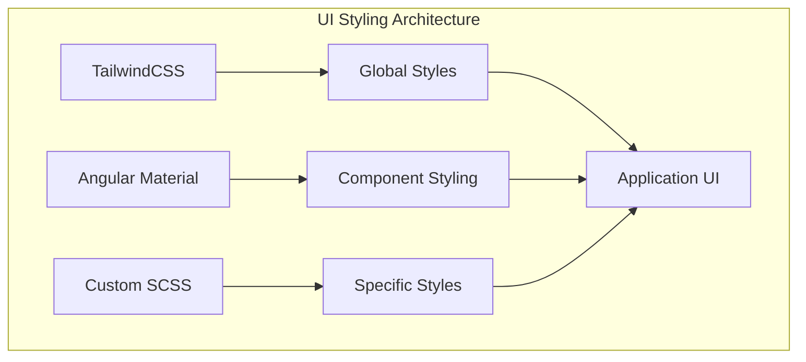
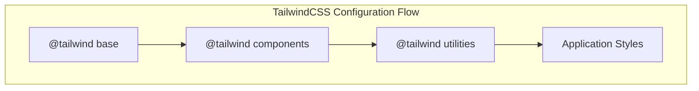
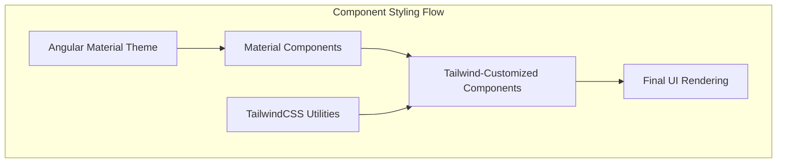
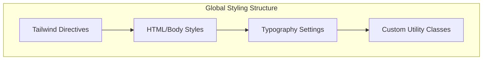
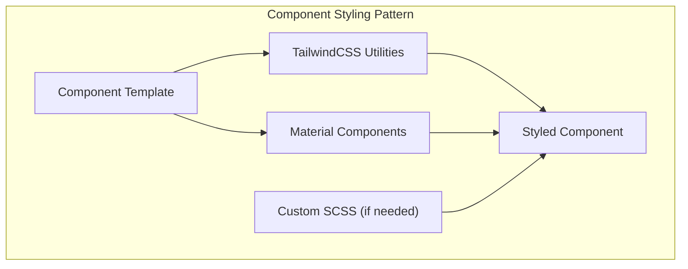
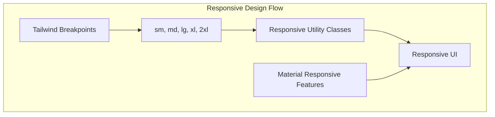
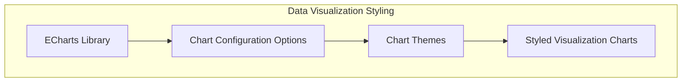
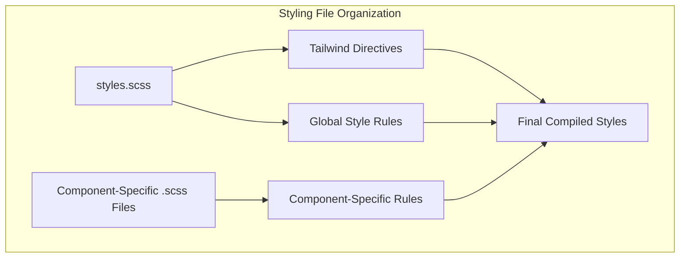

# UI Styling e Theming

## Objetivo e escopo

Este documento descreve a abordagem de estilização e tematização da interface do usuário (IU) implementada no aplicativo Agile Wheel. Ele aborda as tecnologias de estilização utilizadas, sua integração, configuração de temas e padrões de estilização. Para obter informações sobre componentes específicos da IU, consulte Componentes de [Aplicativos Frontend](index.md) e [Atividades](component-activity.md).

## Visão geral das tecnologias de estilo

O aplicativo Agile Wheel emprega uma abordagem de estilo moderna que combina CSS com foco em utilidade com estilo baseado em componentes:

### Primary Styling Technologies

| Technology       | Purpose                                                                                        | Implementation                                              |
|------------------|------------------------------------------------------------------------------------------------|-------------------------------------------------------------|
| TailwindCSS      | Framework CSS utilitário para desenvolvimento rápido de IU                                     | Configurado na raiz da aplicação                            |
| Angular Material | Biblioteca de componentes que fornece elementos de interface de usuário pré-estilizados	    | Importado e usado para formulários, botões e outros elementos da interface do usuário |
| Custom SCSS      | Necessidades de estilo específicas do projeto	                                                | Aplicado para estilos globais e estilos específicos de componentes |

## Implementação do TailwindCSS

O TailwindCSS serve como base para a abordagem de estilo do aplicativo, fornecendo classes utilitárias que podem ser compostas para criar designs personalizados.

### Configuração e Integração

O TailwindCSS é integrado no nível raiz do aplicativo com as seguintes diretivas no arquivo de estilos principal:

A configuração do TailwindCSS segue o padrão:

1. **`@tailwind base`** - Injeta os estilos básicos do Tailwind
2. **`@tailwind components`** - Injeta classes de componentes
3. **`@tailwind utilities`** - Injeta classes de utilidade

Essas diretivas garantem que todas as classes de utilitários do Tailwind estejam disponíveis em todo o aplicativo, permitindo o desenvolvimento rápido da interface do usuário por meio da composição de classes em modelos HTML.

## Angular Material Integration

O aplicativo utiliza componentes do Angular Material para manter uma aparência consistente, ao mesmo tempo em que se beneficia de recursos de acessibilidade pré-criados.

O aplicativo inclui os principais pacotes do Angular Material:

- **`@angular/material`** - A biblioteca de componentes principais
- **`@angular/cdk`** - O kit de desenvolvimento de componentes que alimenta o Material

Esses pacotes fornecem componentes estilizados que são consistentes com os princípios do Material Design, ao mesmo tempo em que permitem personalização por meio de temas do Material e classes de utilitários do Tailwind.

## Global Styling Configuration

O aplicativo estabelece estilos globais que se aplicam a todo o aplicativo, garantindo um estilo base consistente:

Os principais elementos globais de estilo incluem:

- Elementos HTML e corpo de altura total
- Redefinição das margens do corpo
- Definição de família de fontes usando Roboto como fonte primária
- Classes de utilitários personalizados, como `.fab-container` botões de ação flutuantes de posição fixa

## Component Styling Patterns

O aplicativo emprega um padrão consistente para estilizar componentes que aproveita os pontos fortes do TailwindCSS e do Angular Material:

Esta abordagem segue estes princípios:

1. Use componentes do Angular Material para elementos complexos de interface do usuário (formulários, caixas de diálogo, etc.)
2. Aplique classes utilitárias TailwindCSS diretamente em modelos para layout e estilo personalizado
3. Use SCSS personalizado somente quando necessário para estilos complexos que não podem ser obtidos com as abordagens acima

## Responsive Design Implementation

O aplicativo implementa design responsivo principalmente por meio de utilitários breakpoint do TailwindCSS, garantindo a exibição adequada em diferentes tamanhos de dispositivos:

## Chart - Data Visualization Styling

Para os componentes de visualização de resultados, o aplicativo usa a biblioteca ECharts, que tem seus próprios recursos de tema e estilo:

## Styling File Organization

O aplicativo segue um padrão de organização de estilo Angular:

Esta organização garante:

1. Os estilos globais são centralizados no arquivo principal styles.scss
2. Estilos específicos de componentes podem ser encapsulados com seus respectivos componentes
3. Os utilitários Tailwind estão disponíveis em todo o aplicativo

## Resumo

A abordagem de estilização e tematização da interface do usuário (UI) no aplicativo Agile Wheel combina o paradigma de utilidade do TailwindCSS com a estilização baseada em componentes do Angular Material. Essa abordagem híbrida fornece um sistema de estilização flexível e sustentável que permite o desenvolvimento rápido da interface do usuário, garantindo a consistência em todo o aplicativo.

O sistema de estilo segue as melhores práticas modernas por:

- Usando classes de utilidade para a maioria das necessidades de estilo
- Aproveitando uma biblioteca de componentes para elementos complexos de IU
- Minimizar CSS personalizado para apenas o necessário
- Garantindo um design responsivo por meio de utilitários de ponto de interrupção integrados

