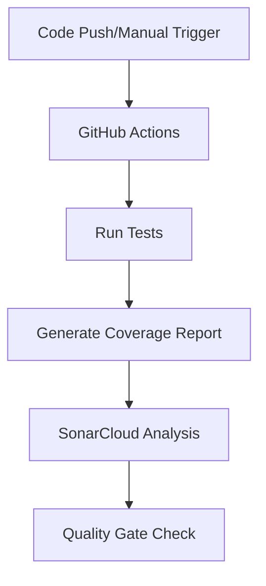
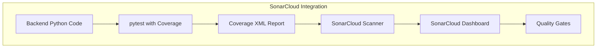
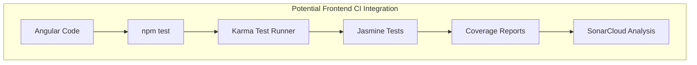
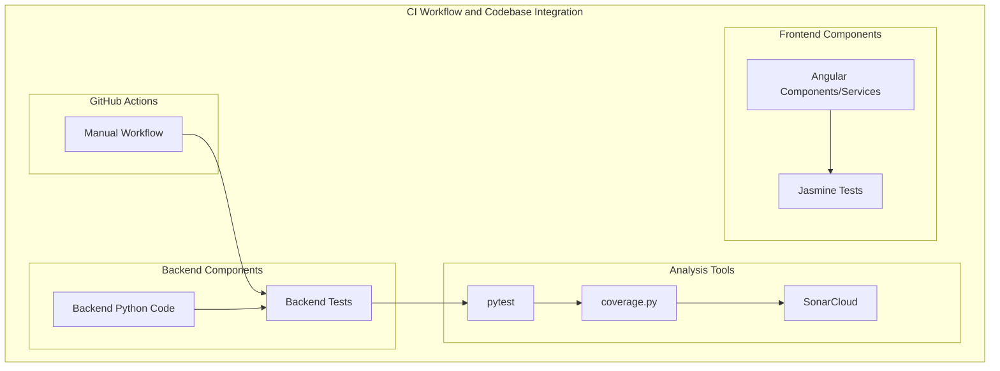

# Continuous Integration

Esta seção documenta o pipeline de Integração Contínua (CI) e as ferramentas de qualidade de código usadas no projeto Agile Wheel. Ela aborda os fluxos de trabalho do GitHub Actions, estratégias de teste e integração com o SonarCloud para análise automatizada da qualidade do código. Para obter informações sobre o processo de configuração e implantação do Docker, consulte [Configuração do Docker](docker-setup.md).

## 1. Visão geral do CI

O projeto Agile Wheel utiliza um pipeline de CI para garantir a qualidade do código por meio de testes automatizados e análise estática de código. As principais ferramentas utilizadas no pipeline são GitHub Actions e SonarCloud.

## 2. GitHub Actions Workflows

O projeto utiliza o GitHub Actions como plataforma principal de CI. Atualmente, o repositório contém um fluxo de trabalho acionado manualmente que executa testes e realiza análises de qualidade de código.

### Fluxo de trabalho manual

O fluxo de trabalho manual está configurado para ser executado sob demanda por meio do evento workflow_dispatch do GitHub. Este fluxo de trabalho consiste em duas tarefas sequenciais:

- **Executar testes**: executa o conjunto de testes e gera relatórios de cobertura
- **Análise SonarCloud**: Analisa a qualidade do código usando os dados de cobertura gerados

```mermaid
flowchart TB
  subgraph "Manual Workflow"
    A[workflow_dispatch Trigger]
    B[run-tests Job]
    C[sonarcloud Job]
    A --> B --> C
  end

  subgraph "run-tests"
    B1[Checkout Code]
    B2[Setup Python 3.12.0]
    B3[Install Poetry]
    B4[Install Dependencies]
    B5[Run pytest with Coverage]
    B6["Generate XML Coverage Report"]
    B7[Upload Coverage as Artifact]
    B1 --> B2 --> B3 --> B4 --> B5 --> B6 --> B7
  end

  subgraph "sonarcloud"
    C1[Checkout Code]
    C2[Download Coverage Artifact]
    C3[Run SonarCloud Analysis]
    C1 --> C2 --> C3
  end
```

## 3. Configuração de teste de backend

O teste de backend é configurado usando pytest com relatórios de cobertura. O fluxo de trabalho instala dependências usando Poetry, uma ferramenta de gerenciamento de dependências do Python.

### Processo de execução de teste

O fluxo de trabalho executa as seguintes etapas para testes de backend:

1. Configura o ambiente Python 3.12.0
2. Instala o Poetry para gerenciamento de dependências
3. Instala dependências do projeto
4. Executa pytest com relatórios de cobertura
5. Gera relatórios de cobertura em vários formatos (terminal, HTML e XML)
6. Carrega o relatório de cobertura como um artefato para uso na análise do SonarCloud

O relatório de cobertura XML é formatado especificamente para consumo pelo SonarCloud para gerar métricas precisas de cobertura de código.

## 4. Code Quality Analysis with SonarCloud

O SonarCloud é usado para análise estática de código para identificar problemas de qualidade, vulnerabilidades e dívidas técnicas. A integração é feita por meio do GitHub Actions.

### SonarCloud Job Configuration

O trabalho de análise do SonarCloud:

1. Faz o download do artefato do relatório de cobertura do trabalho de teste
2. Executa a ação do scanner SonarQube usando o token configurado no ambiente
3. Relata os resultados de volta ao painel do SonarCloud

## 5. CI Pipeline Dependencies

O pipeline de CI depende de várias dependências importantes para funcionar corretamente:

| Component      | Description                               | Configuration Location        |
|----------------|-------------------------------------------|-------------------------------|
| GitHub Actions | CI platform that executes workflows       | .github/workflows/            |
| pytest         | Python testing framework                  | Backend dependencies          |
| coverage.py    | Code coverage tool integrated with pytest | Backend testing config        |
| Poetry         | Python dependency management              | Backend package management    |
| SonarCloud     | Code quality analysis platform            | Configured via GitHub Actions |

## 6. Frontend Testing Capabilities

Embora não esteja explicitamente configurado no pipeline de CI atual, o frontend tem as dependências necessárias para dar suporte a testes automatizados por meio do Jasmine e do Karma.

### Ferramentas de teste de front-end

O projeto de frontend Angular inclui as seguintes dependências relacionadas a testes:

- Jasmine: Estrutura de testes JavaScript
- Karma: Executor de testes para aplicações Angular
- karma-chrome-launcher: permite que os testes sejam executados no navegador Chrome
- karma-coverage: Fornece relatórios de cobertura de código
- karma-jasmine-html-reporter: Gera relatórios HTML para resultados de testes

Essas ferramentas podem ser integradas ao pipeline de CI estendendo o fluxo de trabalho existente do GitHub Actions para incluir testes de front-end.

## 7. CI Workflow Relation to Codebase

O fluxo de trabalho do CI interage com diferentes componentes da base de código do Agile Wheel para garantir qualidade e cobertura de testes.

## 8. Melhorias futuras de CI

Com base na configuração atual, vários aprimoramentos podem ser feitos no pipeline de CI:

1. Testes frontend automatizados usando a configuração Jasmine/Karma existente
2. Gatilhos de fluxo de trabalho automatizados em solicitações de pull e push para o branch principal
3. Integração com processos de construção e implantação do Docker
4. Verificações de qualidade de código específicas do frontend usando ESLint/TSLint

Essas melhorias proporcionariam uma cobertura de teste mais abrangente e garantia de qualidade em toda a base de código.