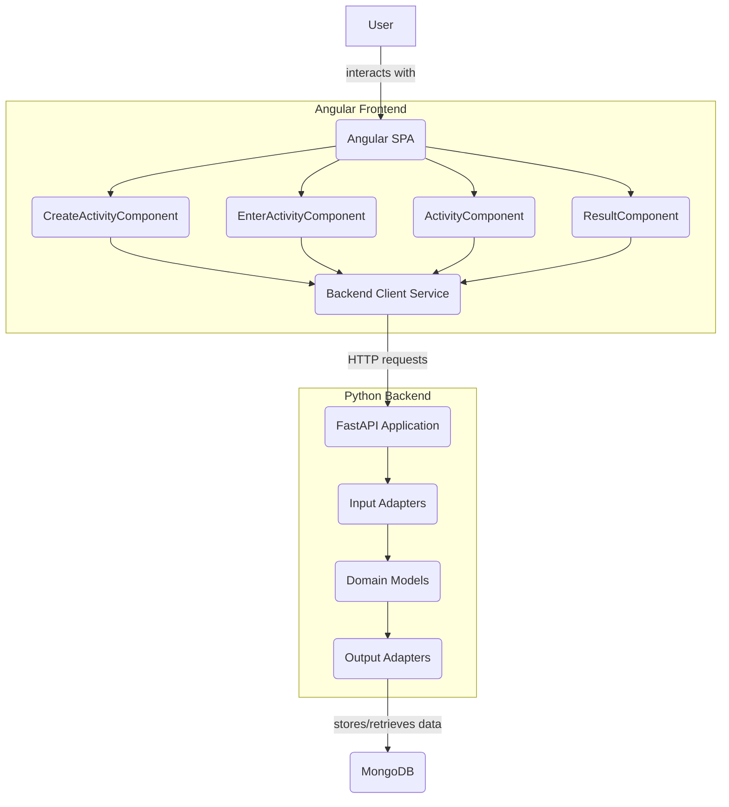
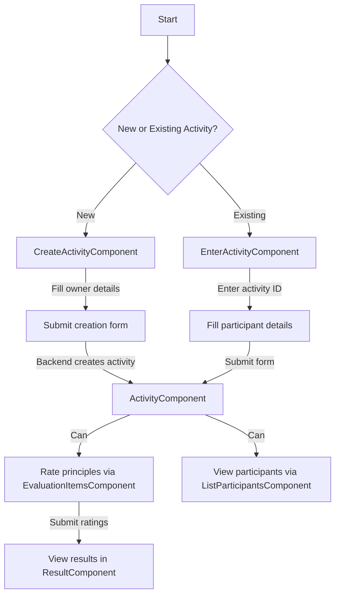
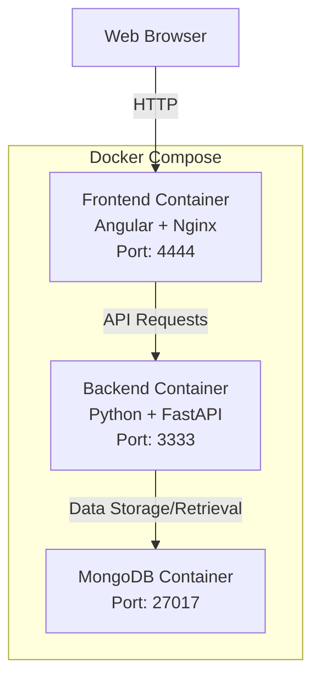
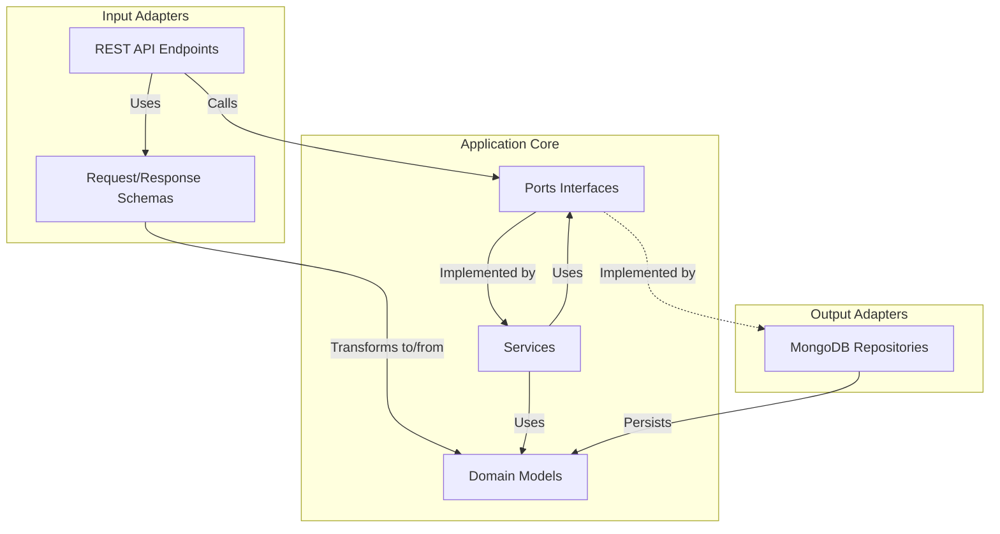
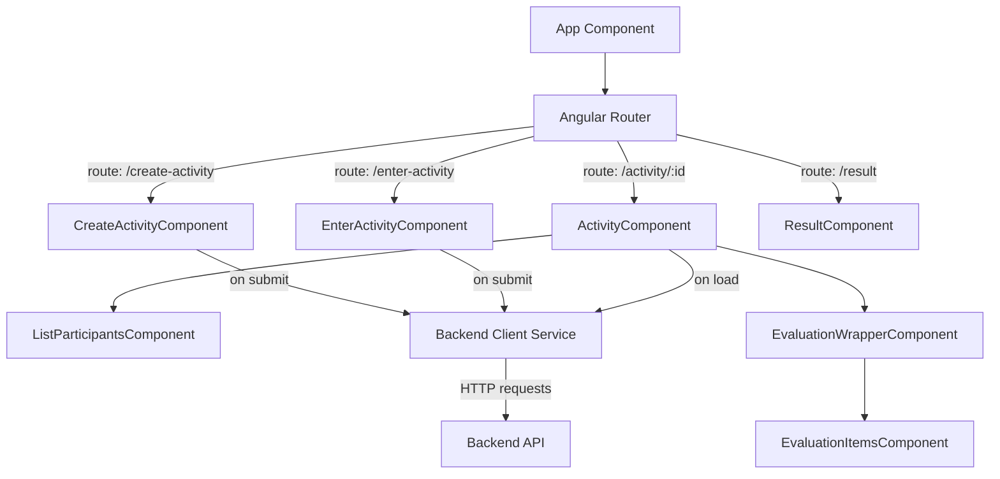

# Docs AI Generated

!!! info

    Essa documentação foi gerada de forma automática pelo [deepwiki.com](https://deepwiki.com)

Essa documentação é o ponta-pé inicial sobre a aplicação Agile Wheel, sua finalidade, arquitetura e componentes principais.

## 1. Objetivo e escopo

O app Agile Wheel facilita a avaliação da maturidade ágil em equipes por meio de uma ferramenta de avaliação visual e colaborativa. Ele permite que equipes distribuídas realizem diagnósticos em tempo real de suas práticas ágeis com base no [framework Agile Wheel](agile-wheel-framework.md) desenvolvido por **[Ana G. Soares](https://www.linkedin.com/in/anagsoares/)**.

Principais objetivos da aplicação:

- Permita que as equipes avaliem sua maturidade em quatro pilares ágeis essenciais
- Gere gráfico do tipo radar para representar níveis de maturidade
- Suporte à colaboração remota em tempo real para equipes distribuídas
- Fornecer uma interface simples e intuitiva para atividades de avaliação

## 2. Funcionalidades Core

O aplicativo Agile Wheel oferece suporte às seguintes atividades principais:

| Funcionalidade             | Descrição                                                        |
|----------------------------|------------------------------------------------------------------|
| Criação de Atividades      | Crie sessões de avaliação para avaliações de equipe              |
| Avaliação de Princípios    | Avalie a maturidade da equipe em vários princípios ágeis         |
| Visualização de Resultados | Gerar e visualizar gráficos de radar dos resultados da avaliação |


## 3. Arquitetura do Sistema

O aplicativo Agile Wheel emprega uma arquitetura full-stack moderna com separação clara de preocupações.

O aplicativo é estruturado como um monorepo contendo 2 sistemas independentes que evoluem juntos:



## 4. Stack de Tecnologia

O aplicativo Agile Wheel aproveita tecnologias modernas para desenvolvimento front-end e back-end:

| Componente      | Stack / Tecnologias                  | Descrição                                                              | 
|-----------------|--------------------------------------|------------------------------------------------------------------------|
| Front-end       | Angular 19, TypeScript, Angular Material, RxJS, ECharts  | Interface de usuário que consome a API e renderiza painéis interativos |
| Backend         | Python 3.12, FastAPI, Pydantic, Beanie/Motor         | API REST, lógica de negócios, camada de persistência                   |
| Banco de dados  | MongoDB                              | Armazenamento de dados para atividades e avaliações                    |
| Infra Local | Docker, Docker Compose              | -                                                                      |
| CI/CD           | Ações do GitHub, SonarCloud          | -                                                                      |


## 5. Modelo de Dados

O modelo de domínio core do Agile Wheel gira em torno de Activity, Dimension e Principle, Evaluantion e Participant.

--8<-- "./docs/_ai-generated/_assets/diagrams/backend-data-model.md"

A estrutura do Agile Wheel consiste em quatro dimensões, cada uma contendo 5 princípios:

1. **Pessoas Sensacionais** (Sensational People)

    - Colaboração e comunicação
    - Motivação e confiança
    - Autonomia e auto-organização
    - Melhoria Contínua
    - Interdisciplinaridade

2. **Experimente e Aprenda Rápido** (Experiment and Learn Fast)

    - Compartilhamento de conhecimento
    - Compromisso com o produto
    - Práticas Lean-Agile
    - Ritmo das entregas
    - Granularidade de demandas

3. **Segurança é um Pré- requisito** (Security is a Prerequisite)

    - Trabalho sustentável
    - Métricas Ágeis
    - Estimativas e contratos ágeis
    - Metas/ORKs
    - Desdobramentos estratégicos

4. **Valor a Todo Instante** (Value at Every Moment)

    - Descoberta/Upstream Kanban
    - Experiência do usuário (UX/UI)
    - Entrega de valor (percebida)
    - Relacionamento com o negócio
    - Satisfação do cliente

## 6. Principais fluxos de usuários

O aplicativo oferece suporte a vários fluxos de usuários principais para a realização de avaliações do Agile Wheel:



Os usuários podem criar uma nova atividade ou participar de uma já existente. Dentro de uma atividade, os participantes podem avaliar vários princípios e quando a atividade estiver finalizada visualizar os resultados agregados em gráficos de radar.

### Arquitetura de Implantação Local

Os componentes frontend e backend necessários para o app são conteinerizado com o Docker e localmente podem ser orquestrados com o Docker Compose, facilitando a implantação em diversos tipos ambientes.



O ambiente pode ser configurado através de variáveis de ambiente:

- Variáveis globais `.env` na raiz do projeto
- Variáveis específicas de serviço para os componentes frontend e backend

## 7. Arquitetura de Backend

O backend segue o padrão de Arquitetura Hexagonal (Ports and Adapters), fornecendo uma separação clara entre lógica de negócios e dependências externas.



Essa arquitetura oferece vários benefícios:

- Separação clara da lógica de negócios das implementações técnicas
- Testabilidade aprimorada por meio do isolamento de dependências
- Maior manutenibilidade e adaptabilidade

## 8. Componentes Frontend

O frontend Angular é estruturado em torno de vários componentes principais que lidam com diferentes aspectos da experiência do usuário:



Esses componentes trabalham juntos para fornecer uma experiência de usuário coesa para criar, participar e participar de atividades de avaliação do Agile Wheel.


```sh
cd frontend

nvm install 22
nvm use 22
npm install

npm run
```

Acesso na porta padrão 4200 do angular: http://localhost:4200

### Frontend Local com Docker

1. Gere a imagem atualizada do backend

```sh
docker build --target prod -t agile-whell-frontend .
```

2. Execute a imagem

```sh
docker run  -d \
-e INTERNAL_PORT=80 \
-e PRODUCTION=false \
-e API_AGILEWHEEL_URL=http://localhost \
-e WS_AGILEWHEEL_URL=ws://localhost \
-p 4444:80 \
--name agile-whell-frontend \
agile-whell-frontend
``` 

Acesso na porta exposta pelo docker: http://localhost:4444