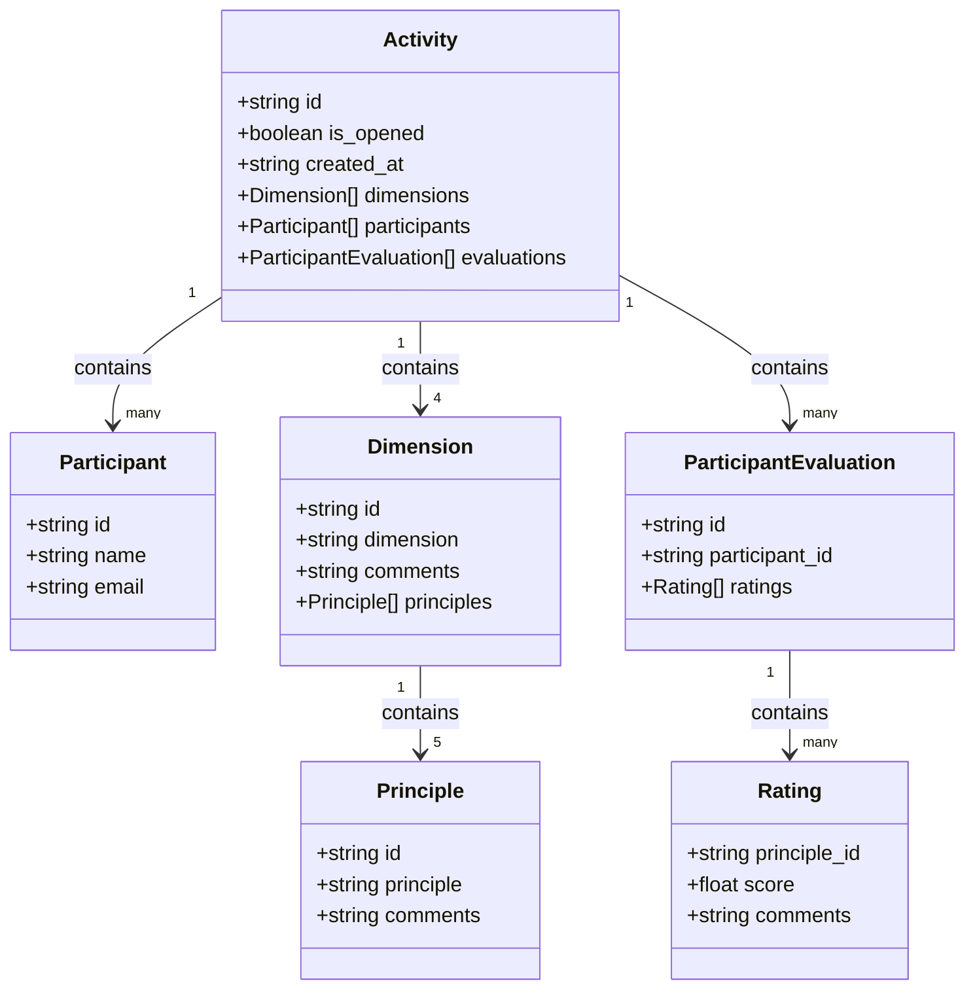

```mermaid
classDiagram
    class Activity {
        +string id
        +boolean is_opened
        +string created_at
        +Dimension[] dimensions
        +Participant[] participants
        +ParticipantEvaluation[] evaluations
    }

    class Participant {
        +string id
        +string name
        +string email
    }

    class Dimension {
        +string id
        +string dimension
        +string comments
        +Principle[] principles
    }

    class Principle {
        +string id
        +string principle
        +string comments
    }

    class ParticipantEvaluation {
        +string id
        +string participant_id
        +Rating[] ratings
    }

    class Rating {
        +string principle_id
        +float score
        +string comments
    }

    Activity "1" --> "many" Participant : contains
    Activity "1" --> "4" Dimension : contains
    Activity "1" --> "many" ParticipantEvaluation : contains
    Dimension "1" --> "5" Principle : contains
    ParticipantEvaluation "1" --> "many" Rating : contains
```