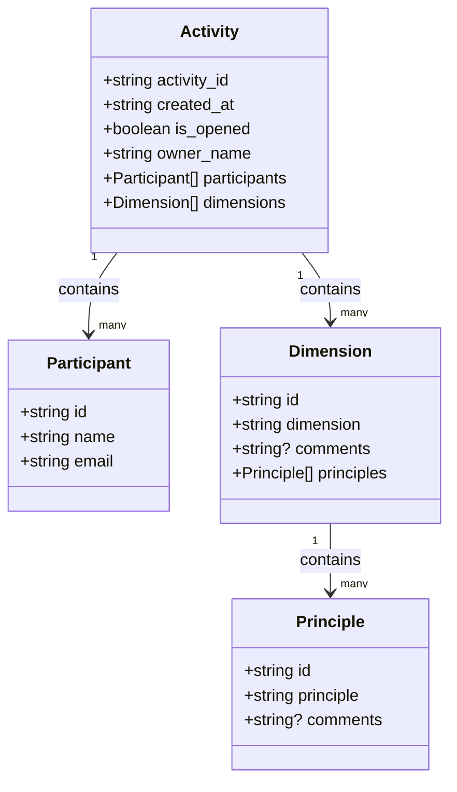

```mermaid
classDiagram
    class Activity {
        +string activity_id
        +string created_at
        +boolean is_opened
        +string owner_name
        +Participant[] participants
        +Dimension[] dimensions
    }

    class Participant {
        +string id
        +string name
        +string email
    }

    class Dimension {
        +string id
        +string dimension
        +string? comments
        +Principle[] principles
    }

    class Principle {
        +string id
        +string principle
        +string? comments
    }

    Activity "1" --> "many" Participant : contains
    Activity "1" --> "many" Dimension : contains
    Dimension "1" --> "many" Principle : contains
```