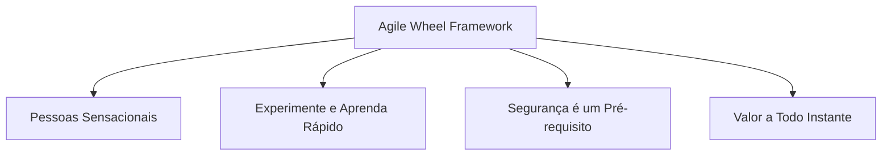
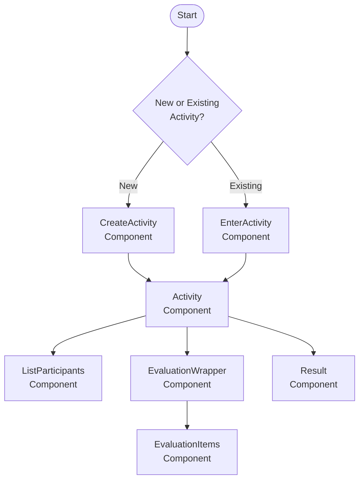
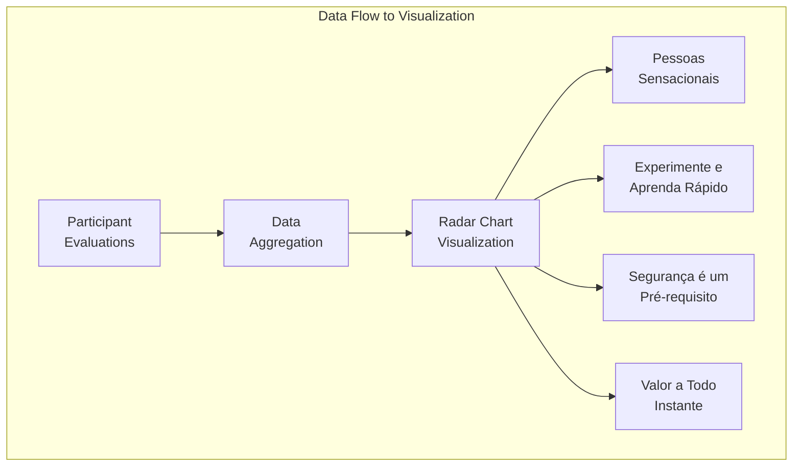
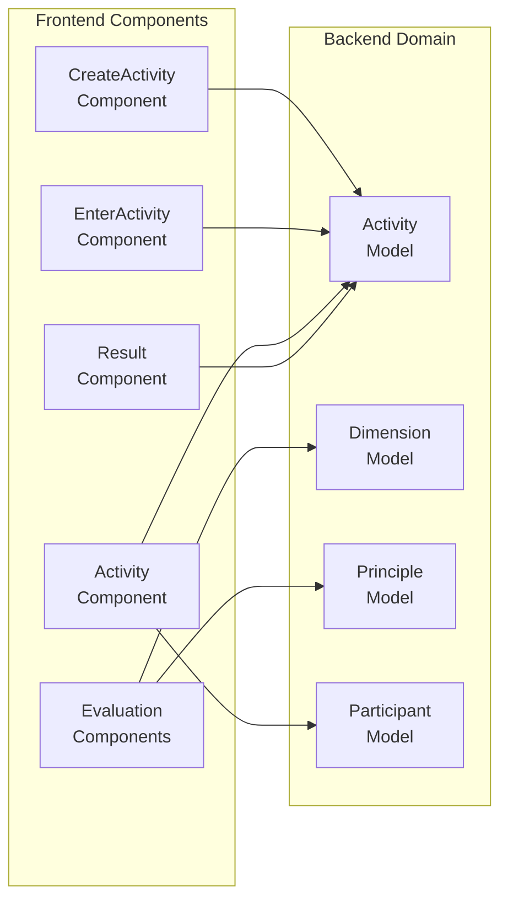

# A estrutura da roda ágil

## 1. Objetivo e escopo

Essa seção descreve o Agile Wheel Framework, que é a metodologia de avaliação implementada pelo aplicativo Agile Wheel. Ele aborda a estrutura conceitual, as dimensões, os princípios do framework e como esses conceitos são implementados no aplicativo. Para obter informações sobre a arquitetura geral do sistema, consulte [Arquitetura do Sistema](1-architecture/index.md).

## 2. Visão geral

O Agile Wheel Framework é uma abordagem visual para mensurar a maturidade ágil em equipes, idealizada por **[Ana G. Soares](https://www.linkedin.com/in/anagsoares/)**. Ele fornece uma metodologia de avaliação organizada em 4 dimensões da agilidade, com cada dimensão contendo cinco princípios que as equipes podem avaliar.

Diferentemente de outras ferramentas de avaliação ágil, a Roda Ágil fornece uma visão holística que equilibra práticas técnicas com fatores humanos, permitindo que as equipes identifiquem áreas de força e oportunidades de crescimento em sua implementação ágil.

## 3. As Quatro Dimensões

A Roda Ágil é estruturada em torno de quatro dimensões fundamentais, cada uma representando um aspecto crítico da maturidade ágil:

## 4. Princípios dentro de cada dimensão

Cada dimensão contém 5 princípios que as equipes avaliam individualmente, para um total de 25 pontos de avaliação:

| **Dimensão** | **Princípios** |
|:-------------|:---------------|
| 1. Pessoas Sensacionais | 1.1 Colaboração e comunicação  1.2 Motivação e confiança  1.3 Autonomia e auto-organização  1.4 Melhoria Contínua  1.5 Interdisciplinaridade |
| 2. Experimente e Aprenda Rápido | 2.1 Compartilhamento de conhecimento 2.2 Comprometimento com o produto 2.3 Práticas Lean-Agile 2.4 Ritmo das entregas 2.5 Granularidade de demandas |
| 3. Segurança é um Pré-requisito | 3.1 Trabalho sustentável 3.2 Métricas Ágeis 3.3 Estimativas & contratos ágeis 3.4 Metas/OKRs 3.5 Desdobramentos estratégicos |
| 4. Valor a Todo Instante | 4.1 Discovery/Upstream Kanban 4.2 Experiência do usuário (UX/UI) 4.3 Entrega de valor (percebido) 4.4 Relacionamento com o negócio 4.5 Satisfação do cliente |

## 5. Implementação da Framerwork

O Agile Wheel Framework é implementado no aplicativo por meio de um modelo de domínio que captura a estrutura de avaliação e uma interface de usuário que facilita o processo de avaliação.

### Representação do Modelo de Domínio

O diagrama a seguir mostra como os conceitos do Agile Wheel Framework são mapeados para o modelo de domínio do aplicativo:

--8<-- "./docs/_assets/diagrams/backend-data-model.md"

Neste modelo:

- Um `Activity` representa uma única sessão de avaliação
- Cada atividade contém múltiplos `Dimensions` (os quatro pilares)
- Cada dimensão contém múltiplos `Principles` (os cinco princípios por dimensão)
- `Participants` se junta à atividade para fornecer suas avaliações

### User Interface Components

O aplicativo fornece diversas interfaces importantes para interagir com o Agile Wheel Framework:

1. **Criação de atividade**: os usuários podem criar uma nova atividade de avaliação
2. **Entrada de atividade**: os participantes podem ingressar em uma avaliação existente
3. **Interface de avaliação**: os participantes podem classificar os princípios dentro das dimensões
4. **Visualização dos resultados**: os resultados da avaliação são exibidos em um gráfico de radar

## 6. Metodologia de Avaliação

### Sistema de Distribuição de Pontos

O Agile Wheel Framework utiliza um sistema de distribuição de pontos para as avaliações. Os participantes recebem um número fixo de pontos para distribuir entre os princípios de cada dimensão, forçando-os a fazer escolhas e priorizar os princípios que acreditam estar mais fortemente representados em sua equipe.

Esta abordagem difere das escalas de classificação tradicionais por:

1. Exigindo julgamento relativo em vez de pontuação absoluta
2. Evitando classificações "todas altas" ou "todas baixas"
3. Incentivar a consideração cuidadosa da força relativa de cada princípio

### Processo de Avaliação Colaborativa

O processo de avaliação foi projetado para ser colaborativo:

1. Um proprietário de atividade cria uma nova sessão de avaliação
2. Os membros da equipe ingressam como participantes usando o ID da atividade
3. Cada participante distribui pontos entre os princípios
4. Os resultados são coletados e agregados
5. A visualização exibe a avaliação coletiva

## 7. Visualização e Resultados

### Visualização do gráfico de radar

O resultado da avaliação da atividade são visualizados como um gráfico de radar (também conhecido como gráfico de aranha ou gráfico de teia), que exibe efetivamente dados multivariados em um formato bidimensional. Isso cria a "roda" visual que dá nome à estrutura.

O gráfico do radar:

- Coloca cada dimensão como um quadrante da roda
- Posiciona os princípios ao longo dos eixos radiais
- Usa a distância do centro para representar a pontuação
- Cria uma "forma" visual da maturidade ágil da equipe

### Interpretação e Ação

A visualização do Agile Wheel foi projetada para interpretação imediata:

1. **Forma equilibrada**: uma forma bem arredondada indica maturidade ágil e equilibrada
2. **Forma irregular**: identifica áreas de força e fraqueza
3. **Comparação**: as equipes podem comparar as avaliações atuais com as anteriores
4. **Melhoria direcionada**: concentre os esforços de melhoria em áreas com pontuação baixa

## 8. Detalhes de implementação técnica

O Agile Wheel Framework é implementado por meio de uma combinação de componentes front-end e back-end:

A estrutura da framework é inicializada quando uma atividade é criada, com todas as quatro dimensões e seus princípios correspondentes pré-preenchidos no banco de dados. À medida que os participantes ingressam e concluem suas avaliações, os dados são armazenados e podem ser recuperados para visualização e análise.

## 9. Conclusão

O Agile Wheel Framework oferece uma abordagem visual e estruturada para a avaliação da maturidade ágil. Ao avaliar equipes em quatro dimensões principais e vinte princípios, ele oferece uma visão abrangente da implementação ágil e identifica áreas específicas para melhoria. O aplicativo implementa esse framework por meio de uma interface amigável que facilita a avaliação colaborativa e a visualização clara dos resultados.

Por meio de sua metodologia de distribuição de pontos e visualização de gráfico de radar, o Agile Wheel Framework permite que as equipes obtenham insights sobre sua maturidade ágil e monitorem seu progresso ao longo do tempo, apoiando a melhoria contínua nas práticas ágeis.